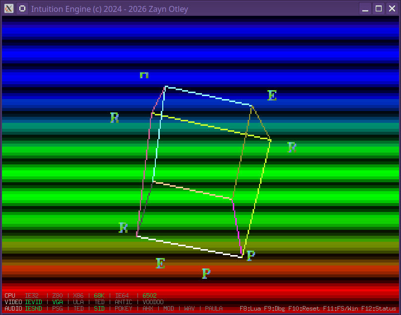

# Intuition Engine



Intuition Engine is a retro computer that never existed but I wish had! :)

It is a Go-based emulator and virtual machine built for demoscene-style hardware experiments, CPU bring-up, tracker playback, and operating-system work. One executable supports six guest CPU modes and can run them concurrently through the coprocessor subsystem, drive several classic-inspired video and audio devices, automate itself with Lua, and boot into BASIC, EmuTOS, AROS, or IntuitionOS development paths.

What makes it worth looking at:

- Six guest CPU modes in one machine: IE64, IE32, M68K, Z80, 6502, and 32-bit x86.
- A real SDK with assemblers, include files, examples, prebuilt demos, and build scripts.
- Multiple display devices in one compositor: IEVideoChip, VGA, ULA, TED video, ANTIC/GTIA, and Voodoo-style 3D.
- Chiptune and module playback paths for PSG/AY/YM, SN76489 VGM, SID, POKEY/SAP, TED, AHX, MOD, and WAV.
- Built-in Machine Monitor, Lua automation, REPL overlay, screenshots, recording support, and scripted test harnesses.
- OS integration work for EmuTOS, AROS, and IntuitionOS rather than only bare-metal demos.

Build it and run the default BASIC environment:

```bash
make
./bin/IntuitionEngine
```

After the VM has been built, build the SDK assets and run a shipped demo:

```bash
make sdk
./bin/IntuitionEngine -ie32 sdk/examples/prebuilt/vga_text_hello.iex
```

Default runtime: when launched with no mode and no filename, the VM starts EhBASIC on IE64.

[](https://ko-fi.com/M4M61AHEFR)

## Contents

1. [Current Scope](#current-scope)
2. [Build](#build)
3. [Run](#run)
4. [Runtime Controls](#runtime-controls)
5. [Architecture Summary](#architecture-summary)
6. [SDK and Toolchains](#sdk-and-toolchains)
7. [Testing](#testing)
8. [Platform Support](#platform-support)
9. [Documentation Index](#documentation-index)
10. [Licence](#licence)

## Current Scope

### CPU Modes

| Mode flag | Guest CPU | Input file | Notes |
|-----------|-----------|------------|-------|
| `-ie64` | IE64 | `.ie64` | 64-bit RISC core. Used by EhBASIC and IntuitionOS work. |
| `-ie32` | IE32 | `.iex`, `.ie32` | 32-bit RISC core with the built-in IE32 assembler. |
| `-m68k` | Motorola 68020 | `.ie68` | 68020-oriented path used by native demos, EmuTOS, and AROS work. |
| `-z80` | Z80 | `.ie80` | Z80 guest mode with AY/PSG-oriented examples. |
| `-m6502` | 6502 | `.ie65` | 6502 guest mode with cc65-style SDK support. |
| `-x86` | 32-bit flat x86 | `.ie86` | Flat 32-bit x86 guest mode. |
| `-basic` | EhBASIC on IE64 | none | Does not accept a positional filename. |
| `-emutos` | EmuTOS on M68K | optional ROM image | Requires embedded EmuTOS, a discovered ROM, or `-emutos-image`. |
| `-aros` | AROS on M68K | optional ROM image | Requires embedded or external AROS assets. |

JIT support depends on host OS and architecture. Current coverage is documented in [Platform Compatibility](sdk/docs/platform-compatibility.md) and [Architecture](sdk/docs/architecture.md).

### Audio

The audio system includes:

- custom `SoundChip` with 10 mixed channels
- AY-3-8910/YM2149 PSG
- native SN76489 bus chip for VGM/VGZ SN writes
- SID 6581/8580, including Multi-SID paths
- POKEY/SAP
- TED audio
- AHX/THX replayer
- ProTracker MOD player
- WAV PCM player
- AROS Paula-style audio DMA shim

Supported playback modes are exposed through `-psg`, `-sid`, `-pokey`, `-ted`, `-ahx`, `-mod`, and `-wav`, with plus modes for selected enhanced render paths: `-psg+`, `-sid+`, `-pokey+`, `-ted+`, and `-ahx+`.

Detailed audio references:

- [Architecture audio overview](sdk/docs/architecture.md)
- [Sound MMIO](sdk/docs/ie_sfx_mmio.md)
- [WAV Player](sdk/docs/wav_player.md)

### Video

The video system includes:

- IEVideoChip with copper, blitter, Mode7-style effects, and compositor integration
- VGA
- ZX Spectrum-style ULA
- TED video
- Atari-style ANTIC/GTIA
- 3DFX Voodoo-style 3D path
- Ebiten display backend for normal desktop builds
- headless display backend for tests and batch runs

Detailed video references:

- [Architecture video overview](sdk/docs/architecture.md)
- [Compositor](sdk/docs/compositor.md)
- [Voodoo ABI](sdk/docs/ie_voodoo_abi.md)

### Scripting and Debugging

- IEScript uses Lua 5.1-compatible semantics through GopherLua.
- Script modules include `sys`, `cpu`, `mem`, `term`, `audio`, `video`, `repl`, `rec`, `dbg`, `coproc`, `media`, and `bit32`.
- The Machine Monitor is available with `F9` in desktop builds and has CPU, memory, breakpoint, watchpoint, trace, I/O view, and scripting support.

References:

- [IEScript](sdk/docs/iescript.md)
- [Machine Monitor](sdk/docs/iemon.md)
- [Coprocessor](sdk/docs/Coprocessor.md)

## Build

Go 1.26 or later is required.

```bash
# Build the VM and core SDK tools
make

# Build only the VM
make intuition-engine

# Build without Vulkan
make novulkan

# Build with stub display and audio backends
make headless

# Build a portable headless binary without CGO
make headless-novulkan
```

Build outputs:

| Output | Produced by |
|--------|-------------|
| `bin/IntuitionEngine` | `make`, `make intuition-engine`, or VM profile targets |
| `sdk/bin/ie32asm` | `make`, `make ie32asm`, `make sdk` |
| `sdk/bin/ie64asm` | `make`, `make ie64asm`, `make sdk` |
| `sdk/bin/ie32to64` | `make`, `make ie32to64`, `make sdk` |
| `sdk/bin/ie64dis` | `make`, `make ie64dis`, `make sdk` |

Build profiles:

| Profile | Command | Use |
|---------|---------|-----|
| full | `make` | Default desktop build with Ebiten, Oto, and Vulkan-capable Voodoo support. |
| novulkan | `make novulkan` | Desktop build without the Vulkan dependency. |
| headless | `make headless` | CI and test build with display and audio stubs. |
| headless-novulkan | `make headless-novulkan` | `CGO_ENABLED=0` portable build with no display or audio backend. |

Useful build targets:

```bash
make sdk
make sdk-build
make players
make basic
make basic-emutos
make emutos
make aros
make list
make clean
make distclean
```

Use [DEVELOPERS.md](DEVELOPERS.md) for full build, release, and contribution details.

## Run

Important: when a command includes a program filename, put all flags before the filename. The Go flag parser used by this program parses flags before the first positional argument.

### CPU and BASIC Modes

```bash
# Default: start EhBASIC on IE64
./bin/IntuitionEngine

# Run guest programs
./bin/IntuitionEngine -ie64 program.ie64
./bin/IntuitionEngine -ie32 program.iex
./bin/IntuitionEngine -m68k program.ie68
./bin/IntuitionEngine -z80 program.ie80
./bin/IntuitionEngine -m6502 program.ie65
./bin/IntuitionEngine -x86 program.ie86

# Run EhBASIC
./bin/IntuitionEngine -basic
./bin/IntuitionEngine -basic -term
./bin/IntuitionEngine -basic-image path/to/ehbasic_ie64.ie64
```

### OS Modes

```bash
# Boot EmuTOS
./bin/IntuitionEngine -emutos
./bin/IntuitionEngine -emutos -emutos-image path/to/emutos.img
./bin/IntuitionEngine -emutos -emutos-drive ~/gemdos-root

# Boot AROS
./bin/IntuitionEngine -aros
./bin/IntuitionEngine -aros -aros-image path/to/aros-ie-m68k.rom
./bin/IntuitionEngine -aros -aros-drive ~/amiga-files
```

EmuTOS and AROS availability depends on embedded assets, local default ROM paths, or explicit image paths. See [EmuTOS Integration](sdk/docs/ie_emutos.md) and the AROS sections in [DEVELOPERS.md](DEVELOPERS.md).

### Audio Playback

```bash
./bin/IntuitionEngine -psg music.ym
./bin/IntuitionEngine -psg+ music.pt3
./bin/IntuitionEngine -sid music.sid
./bin/IntuitionEngine -sid music.sid -sid-pal
./bin/IntuitionEngine -sid music.sid -sid-ntsc
./bin/IntuitionEngine -sid+ music.sid
./bin/IntuitionEngine -pokey music.sap
./bin/IntuitionEngine -pokey+ music.sap
./bin/IntuitionEngine -ted music.ted
./bin/IntuitionEngine -ted+ music.prg
./bin/IntuitionEngine -ahx music.ahx
./bin/IntuitionEngine -ahx+ music.ahx
./bin/IntuitionEngine -mod music.mod
./bin/IntuitionEngine -wav sound.wav
```

### Scripting, Performance, and Display Options

```bash
# Script with no program file starts the default BASIC runtime
./bin/IntuitionEngine -script script.ies

# Script alongside a guest program
./bin/IntuitionEngine -ie64 -script script.ies program.ie64

# Performance and interpreter-only runs
./bin/IntuitionEngine -ie64 -perf program.ie64
./bin/IntuitionEngine -ie64 -nojit program.ie64

# Display options
./bin/IntuitionEngine -ie32 -scale 2 program.iex
./bin/IntuitionEngine -m68k -fullscreen program.ie68
./bin/IntuitionEngine -ie64 -width 800 -height 600 program.ie64

# Runtime information
./bin/IntuitionEngine -version
./bin/IntuitionEngine -features
```

### Single-Instance File Opening

If a desktop build is already running, opening a supported file can hand it to the running instance through the IPC path. Supported extensions in the runtime helper are:

| Extension | Mode |
|-----------|------|
| `.iex`, `.ie32` | IE32 |
| `.ie64` | IE64 |
| `.ie65` | 6502 |
| `.ie68` | M68K |
| `.ie80` | Z80 |
| `.ie86` | x86 |
| `.tos`, `.img` | EmuTOS |
| `.ies` | IEScript |

Desktop file association targets are Linux-oriented:

```bash
sudo make install-desktop-entry
make set-default-handler
```

## Runtime Controls

Desktop builds use the Ebiten backend.

| Key | Action |
|-----|--------|
| `F8` | Toggle the Lua REPL overlay, unless the Machine Monitor is active. |
| `F9` | Toggle the Machine Monitor. |
| `F10` | Hard reset. |
| `F11` | Toggle fullscreen. |
| `F12` | Toggle the runtime status bar. |
| `Page Up` / `Page Down` | Scroll terminal scrollback where supported. |
| Mouse wheel | Scroll terminal scrollback where supported. |

Machine Monitor command examples:

| Command | Meaning |
|---------|---------|
| `r` | Show registers. |
| `d [addr] [count]` | Disassemble. |
| `m <addr> [count]` | Hex dump memory. |
| `s [count]` | Step instructions. |
| `g [addr]` | Resume, optionally from an address. |
| `b <addr> [cond]` | Set a breakpoint. |
| `ww <addr>` | Set a write watchpoint. |
| `io [device|all]` | Inspect I/O registers. |
| `cpu [n]` | Switch focused CPU in multi-CPU debugging. |
| `x` | Exit the monitor and resume. |

See [Machine Monitor](sdk/docs/iemon.md) for the full command reference.

## Architecture Summary

The central runtime components are:

- `MachineBus`: guest RAM, MMIO dispatch, I/O page fast paths, and guest RAM sizing.
- CPU runners: IE64, IE32, M68K, Z80, 6502, and x86.
- JIT infrastructure: host-specific JIT backends where available.
- Audio engines and players: custom SoundChip plus chip-specific parsers, players, and MMIO handlers.
- Video engines: IEVideoChip, VGA, ULA, TED video, ANTIC/GTIA, Voodoo, and compositor.
- Debugging: Machine Monitor, disassemblers, breakpoints, watchpoints, traces, and CPU-local snapshots.
- Scripting: IEScript Lua automation and REPL overlay.
- OS integration: EmuTOS loader, AROS loader, GEMDOS/AROS DOS paths, and IntuitionOS runtime work.

Guest RAM is sized at boot from the host and profile constraints. Guest software can query memory sizing through the SYSINFO MMIO registers and, on IE64, `CR_RAM_SIZE_BYTES`. The detailed memory and MMIO layout belongs in [Architecture](sdk/docs/architecture.md), [IE64 ISA](sdk/docs/IE64_ISA.md), [Sound MMIO](sdk/docs/ie_sfx_mmio.md), [Voodoo ABI](sdk/docs/ie_voodoo_abi.md), and [IntuitionOS IExec](sdk/docs/IntuitionOS/IExec.md).

## SDK and Toolchains

The SDK contains headers, examples, prebuilt demo outputs, assets, and scripts under [sdk/](sdk/).

| Guest | Main toolchain | Typical output |
|-------|----------------|----------------|
| IE32 | `sdk/bin/ie32asm` | `.iex` |
| IE64 | `sdk/bin/ie64asm` | `.ie64` |
| M68K | `vasmm68k_mot` | `.ie68` |
| Z80 | `vasmz80_std` | `.ie80` |
| 6502 | `ca65` / `ld65` | `.ie65` |
| x86 | `nasm` | `.ie86` |

Common SDK commands:

```bash
make sdk
make sdk-build
./sdk/scripts/build-all.sh
./bin/IntuitionEngine -ie32 sdk/examples/prebuilt/vga_text_hello.iex
```

Core SDK references:

- [SDK README](sdk/README.md)
- [SDK Getting Started](sdk/docs/sdk-getting-started.md)
- [Toolchains](sdk/docs/toolchains.md)
- [Include Files](sdk/docs/include-files.md)
- [Demo Matrix](sdk/docs/demo-matrix.md)
- [Tutorial](sdk/docs/TUTORIAL.md)

## Testing

Use the `headless` build tag for normal test runs.

```bash
go test -tags headless ./...
go test -tags headless -run TestName ./...
go test -tags headless -timeout 10m -count=1 ./...
```

Makefile test and check targets:

```bash
make test
make vet
make check-docs
make test-race
make test-harte-short
make test-x86-harte-short
```

Long-running or external-data test suites are opt-in:

```bash
make testdata-harte
make test-harte
make testdata-x86
make test-x86-harte
go test -tags audiolong -run TestSineWave_BasicWaveforms
go test -tags videolong -run TestFireEffect
```

For broad code changes, prefer the verification guidance in [DEVELOPERS.md](DEVELOPERS.md).

## Platform Support

Summary from [Platform Compatibility](sdk/docs/platform-compatibility.md):

| Platform | Architecture | Maintained profiles |
|----------|--------------|---------------------|
| Linux | x86_64 | `full`, `novulkan`, `headless`, `headless-novulkan` |
| Linux | aarch64 | `full`, `novulkan`, `headless`, `headless-novulkan` |
| Windows | x86_64 | `novulkan` |
| Windows | ARM64 | `novulkan` |
| macOS | x86_64 | `novulkan` |
| macOS | ARM64 | `novulkan` |

The full Linux profile may need a native C toolchain and Vulkan SDK or drivers. Use `novulkan` when Vulkan is not available. Use `headless-novulkan` for a portable no-CGO build.

JIT support is asymmetric by host platform. Check [Platform Compatibility](sdk/docs/platform-compatibility.md) before relying on JIT for a specific guest and host combination.

## Documentation Index

Project and developer workflow:

- [Developer Guide](DEVELOPERS.md)
- [Changelog](CHANGELOG.md)
- [Release Process](sdk/docs/release-process.md)
- [Platform Compatibility](sdk/docs/platform-compatibility.md)

Architecture and hardware:

- [Architecture](sdk/docs/architecture.md)
- [Compositor](sdk/docs/compositor.md)
- [Sound MMIO](sdk/docs/ie_sfx_mmio.md)
- [Voodoo ABI](sdk/docs/ie_voodoo_abi.md)
- [WAV Player](sdk/docs/wav_player.md)
- [Coprocessor](sdk/docs/Coprocessor.md)

CPU and tools:

- [IE64 ISA](sdk/docs/IE64_ISA.md)
- [IE64 ABI](sdk/docs/IE64_ABI.md)
- [IE64 Cookbook](sdk/docs/IE64_COOKBOOK.md)
- [IE64 JIT](sdk/docs/IE64_JIT.md)
- [M68K JIT](sdk/docs/M68K_JIT.md)
- [6502 JIT](sdk/docs/6502_JIT.md)
- [x86 JIT](sdk/docs/x86_JIT.md)
- [IE32 to IE64 Converter](sdk/docs/ie32to64.md)

Scripting, monitor, and SDK:

- [IEScript](sdk/docs/iescript.md)
- [Machine Monitor](sdk/docs/iemon.md)
- [SDK README](sdk/README.md)
- [SDK Getting Started](sdk/docs/sdk-getting-started.md)
- [Toolchains](sdk/docs/toolchains.md)
- [Demo Matrix](sdk/docs/demo-matrix.md)
- [Tutorial](sdk/docs/TUTORIAL.md)

OS integration:

- [EmuTOS Integration](sdk/docs/ie_emutos.md)
- [IntuitionOS IExec](sdk/docs/IntuitionOS/IExec.md)
- [IntuitionOS HostFS](sdk/docs/IntuitionOS/HostFS.md)
- [IntuitionOS Toolchain](sdk/docs/IntuitionOS/Toolchain.md)
- [IntuitionOS ELF](sdk/docs/IntuitionOS/ELF.md)
- [IntuitionOS TED](sdk/docs/IntuitionOS/TED.md)

## Licence

Intuition Engine is under GPLv3 or later. See [LICENSE](LICENSE).

Project links:

- <https://github.com/intuitionamiga/IntuitionEngine>
- <https://www.youtube.com/@IntuitionAmiga/>
