# Intuition Engine Architecture

*Last updated: 2026-05-07*

Intuition Engine is a multi-CPU fantasy computer with 6 heterogeneous CPU cores, 6 video systems, 9 audio engines/players, a copper coprocessor, DMA blitter, and extensive I/O peripherals - all connected through a unified MachineBus. Total guest RAM is autodetected at boot from host `/proc/meminfo` minus a per-platform reserve (see `memory_sizing.go`); each CPU/profile sees an active visible RAM clamped to its own ceiling. Guest software discovers sizes through the SYSINFO MMIO pairs (`SYSINFO_TOTAL_RAM_LO/HI`, `SYSINFO_ACTIVE_RAM_LO/HI`) and IE64 `CR_RAM_SIZE_BYTES`. This document describes the system architecture with diagrams showing chips, buses, internal functional units, and data flow paths.

The diagrams below describe wired runtime behavior. Source-file presence alone is not treated as support: for example, `jit_z80_emit_arm64.go` exists, but `jit_z80_dispatch.go` keeps Z80 JIT available only when `runtime.GOARCH == "amd64"`.

## Single Complete Architecture Diagram

```mermaid
flowchart LR
    subgraph HOST["Host process and tooling"]
        MAIN["main.go<br/>CLI flags and boot profile"]
        SIZE["memory_sizing.go<br/>host-sized guest RAM"]
        PB["profile_bounds.go<br/>profile visible-RAM clamps"]
        DBG["Debug monitor<br/>breakpoints, watchpoints,<br/>CPU-local snapshots"]
        LUA["ScriptEngine<br/>Lua / IEScript"]
        SDK["SDK tools<br/>ie32asm, ie64asm, ie64dis,<br/>ie32to64, test generators"]
    end

    subgraph EXECUTION["Guest execution"]
        EXEC["ProgramExecutor<br/>EXEC MMIO and CPU switching"]
        COPROC["CoprocessorManager<br/>worker lifecycle and tickets"]
        IE32["IE32 interpreter"]
        IE64["IE64 interpreter"]
        M68K["M68K 68020 interpreter"]
        Z80["Z80 interpreter"]
        C6502["6502 interpreter"]
        X86["x86 interpreter / JIT-required amd64 path"]
        JIE64["IE64 JIT<br/>amd64 + arm64"]
        J6502["6502 JIT<br/>amd64"]
        JM68K["M68K JIT<br/>amd64"]
        JZ80["Z80 JIT<br/>amd64 only"]
        JX86["x86 JIT<br/>amd64 only"]
        CPUMON["Debug CPU adapters<br/>IE32, IE64, M68K, Z80, 6502, x86"]
    end

    subgraph BUSMEM["Shared address space"]
        BUS["MachineBus<br/>RAM, MapIO, MapIOByte,<br/>MapIO64, ioPageBitmap"]
        RAM["Guest RAM<br/>host-sized, profile-clamped"]
        SYSINFO["SYSINFO MMIO<br/>total/active RAM"]
        VGAMEM["VGA windows<br/>0xA0000 graphics<br/>0xB8000 text"]
        VRAM["Video RAM<br/>0x100000-0x5FFFFF"]
        ULAMEM["ULA VRAM aperture<br/>0xFA000-0xFBAFF"]
        VOOTEX["Voodoo texture memory<br/>0xD0000-0xDFFFF"]
        AROSMEM["AROS memory<br/>Fast RAM + video RAM"]
        COPMEM["Coprocessor memory slices<br/>IE32, IE64, M68K,<br/>Z80, 6502, x86"]
        MAILBOX["Coprocessor mailboxes<br/>0x790000-0x7917FF"]
        STAGING["Media staging buffer<br/>0x800000"]
    end

    subgraph OSLOAD["OS and loader shims"]
        EMUTOS["EmuTOS loader"]
        GEMDOS["GEMDOS intercept"]
        XBIOS["XBIOS intercept"]
        AROS["AROS loader"]
        ADOS["AROS DOS handler"]
        ADMA["AROS Paula-style audio DMA"]
        HOSTFS["Bootstrap HostFS"]
        FILEIO["File I/O MMIO"]
        MEDIA["Media loader"]
        CLIP["Clipboard bridge"]
        TERM["Terminal / serial / keyboard / mouse"]
        IRQD["IRQ diagnostic registers"]
    end

    subgraph VIDEO["Video systems"]
        VCHIP["VideoChip<br/>layer 0"]
        COPPER["Copper<br/>WAIT / MOVE / SETBASE / END"]
        BLITTER["DMA blitter<br/>copy, fill, line, alpha,<br/>color expansion, Mode7"]
        VCHPAL["VideoChip palette / CLUT8"]
        VGA["VGA<br/>layer 10"]
        VGASEQ["VGA sequencer"]
        VGACRTC["VGA CRTC"]
        VGAGC["VGA graphics controller"]
        VGADAC["VGA DAC"]
        TEDV["TED video<br/>layer 12"]
        ANTIC["ANTIC<br/>layer 13"]
        GTIA["GTIA<br/>colors, priority, collisions"]
        ULA["ULA<br/>layer 15"]
        VOO["Voodoo 3D<br/>layer 20"]
        VOORAST["Voodoo rasterizer<br/>triangles, texture, Z,<br/>alpha, fog, chroma key"]
        COMP["VideoCompositor<br/>layers 0/10/12/13/15/20"]
    end

    subgraph AUDIO["Audio systems"]
        SOUND["SoundChip<br/>10 flex channels + mixer"]
        SFX["SFX trigger channels"]
        PSG["PSG / AY-3-8910"]
        AYPLAYER["AY player"]
        SN["SN76489"]
        SID1["SID1"]
        SID2["SID2"]
        SID3["SID3"]
        SIDPLAYER["SID player"]
        POKEY["POKEY"]
        SAP["SAP player"]
        TEDA["TED audio"]
        TEDPLAYER["TED player"]
        AHX["AHX engine"]
        AHXPLAYER["AHX player"]
        MOD["MOD player"]
        WAV["WAV player"]
    end

    subgraph BACKENDS["Host backends"]
        EB["Ebiten video output"]
        HV["Headless video output"]
        OTO["OTO audio output"]
        HA["Headless audio output"]
        VULKAN["Voodoo Vulkan backend"]
        VSOFT["Voodoo software backend"]
    end

    MAIN --> SIZE --> BUS
    SIZE --> RAM
    PB --> RAM
    MAIN --> EXEC
    EXEC --> IE32
    EXEC --> IE64
    EXEC --> M68K
    EXEC --> Z80
    EXEC --> C6502
    EXEC --> X86
    EXEC --> COPROC
    COPROC --> IE32
    COPROC --> IE64
    COPROC --> M68K
    COPROC --> Z80
    COPROC --> C6502
    COPROC --> X86
    IE64 --> JIE64
    C6502 --> J6502
    M68K --> JM68K
    Z80 --> JZ80
    X86 --> JX86
    IE32 <--> BUS
    IE64 <--> BUS
    M68K <--> BUS
    Z80 <--> BUS
    C6502 <--> BUS
    X86 <--> BUS
    JIE64 <--> BUS
    J6502 <--> BUS
    JM68K <--> BUS
    JZ80 <--> BUS
    JX86 <--> BUS
    DBG --> CPUMON
    CPUMON --> IE32
    CPUMON --> IE64
    CPUMON --> M68K
    CPUMON --> Z80
    CPUMON --> C6502
    CPUMON --> X86
    LUA -.-> BUS

    BUS <--> RAM
    BUS <--> SYSINFO
    BUS <--> VGAMEM
    BUS <--> VRAM
    BUS <--> ULAMEM
    BUS <--> VOOTEX
    BUS <--> AROSMEM
    BUS <--> COPMEM
    BUS <--> MAILBOX
    BUS <--> STAGING

    BUS <--> EMUTOS
    EMUTOS --> GEMDOS
    EMUTOS --> XBIOS
    BUS <--> AROS
    AROS --> ADOS
    AROS --> ADMA
    BUS <--> HOSTFS
    BUS <--> FILEIO
    BUS <--> MEDIA
    BUS <--> CLIP
    BUS <--> TERM
    BUS <--> IRQD

    BUS <--> VCHIP
    VCHIP --> COPPER
    VCHIP --> BLITTER
    VCHIP --> VCHPAL
    BUS <--> VGA
    VGA --> VGASEQ
    VGA --> VGACRTC
    VGA --> VGAGC
    VGA --> VGADAC
    BUS <--> TEDV
    BUS <--> ANTIC
    ANTIC --> GTIA
    BUS <--> ULA
    BUS <--> VOO
    VOO --> VOORAST
    VCHIP --> COMP
    VGA --> COMP
    TEDV --> COMP
    ANTIC --> COMP
    ULA --> COMP
    VOO --> COMP

    BUS <--> SOUND
    SOUND --> SFX
    BUS <--> PSG
    AYPLAYER --> PSG
    BUS <--> SN
    BUS <--> SID1
    BUS <--> SID2
    BUS <--> SID3
    SIDPLAYER --> SID1
    SIDPLAYER --> SID2
    SIDPLAYER --> SID3
    BUS <--> POKEY
    SAP --> POKEY
    BUS <--> TEDA
    TEDPLAYER --> TEDA
    BUS <--> AHX
    AHXPLAYER --> AHX
    BUS <--> MOD
    BUS <--> WAV
    PSG --> SOUND
    SN --> SOUND
    SID1 --> SOUND
    SID2 --> SOUND
    SID3 --> SOUND
    POKEY --> SOUND
    TEDA --> SOUND
    AHX --> SOUND
    MOD --> SOUND
    WAV --> SOUND
    ADMA --> SOUND

    COMP --> EB
    COMP --> HV
    SOUND --> OTO
    SOUND --> HA
    VOO --> VULKAN
    VOO --> VSOFT
    SDK -.-> EXEC

    classDef host fill:#455A64,stroke:#263238,color:#fff
    classDef cpu fill:#1565C0,stroke:#0D47A1,color:#fff
    classDef bus fill:#B71C1C,stroke:#7F0000,color:#fff
    classDef os fill:#6A1B9A,stroke:#4A148C,color:#fff
    classDef video fill:#2E7D32,stroke:#1B5E20,color:#fff
    classDef audio fill:#EF6C00,stroke:#BF360C,color:#fff
    classDef backend fill:#37474F,stroke:#263238,color:#fff

    class MAIN,SIZE,PB,DBG,LUA,SDK host
    class EXEC,COPROC,IE32,IE64,M68K,Z80,C6502,X86,JIE64,J6502,JM68K,JZ80,JX86,CPUMON cpu
    class BUS,RAM,SYSINFO,VGAMEM,VRAM,ULAMEM,VOOTEX,AROSMEM,COPMEM,MAILBOX,STAGING bus
    class EMUTOS,GEMDOS,XBIOS,AROS,ADOS,ADMA,HOSTFS,FILEIO,MEDIA,CLIP,TERM,IRQD os
    class VCHIP,COPPER,BLITTER,VCHPAL,VGA,VGASEQ,VGACRTC,VGAGC,VGADAC,TEDV,ANTIC,GTIA,ULA,VOO,VOORAST,COMP video
    class SOUND,SFX,PSG,AYPLAYER,SN,SID1,SID2,SID3,SIDPLAYER,POKEY,SAP,TEDA,TEDPLAYER,AHX,AHXPLAYER,MOD,WAV audio
    class EB,HV,OTO,HA,VULKAN,VSOFT backend
```

## 1. Whole-System Architecture

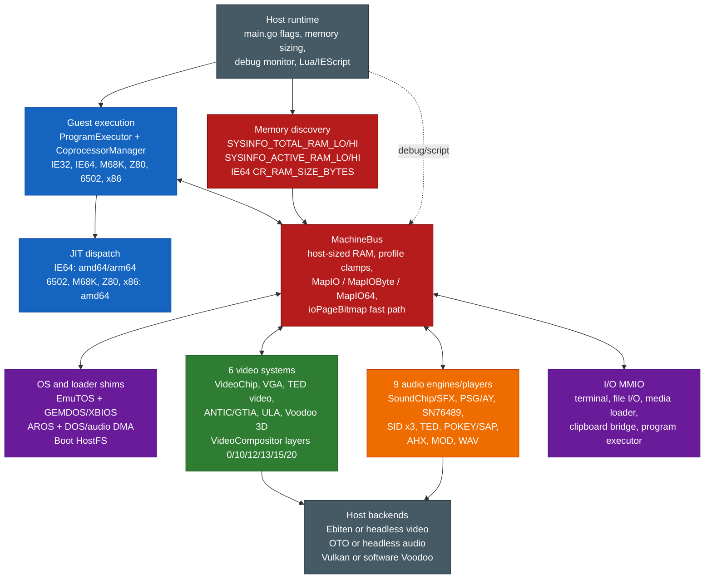

## 2. Layered System Overview

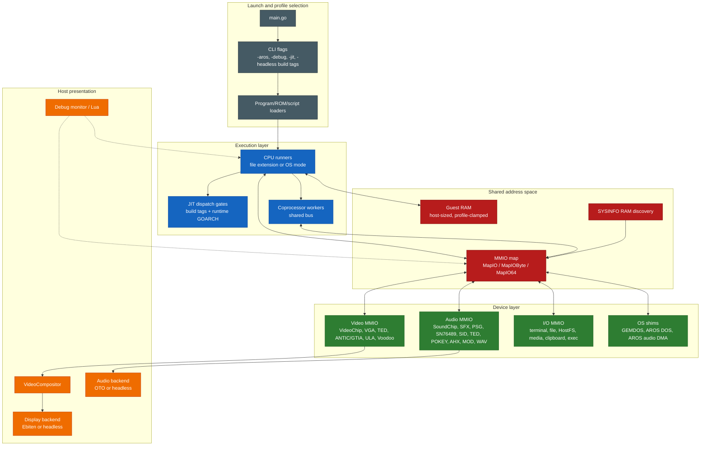

**Bus architecture notes:**

- **Concurrent multi-CPU bus** - the Program Executor selects the primary CPU mode, but the Coprocessor Manager can launch additional worker CPUs that run concurrently on the same bus. Lock-free bus design (immutable `MapIO` dispatch, `ioPageBitmap` fast path, I/O callbacks protect their own state) allows safe concurrent access without bus arbitration.
- **No centralised interrupt controller** - each CPU has per-CPU interrupt lines (IRQ/NMI as `atomic.Bool`). Peripherals signal the active CPU directly.
- **MMIO dispatch** - the bus uses an `ioPageBitmap []bool` fast path (page = 256 bytes). Non-I/O pages use direct unsafe pointer access with zero dispatch overhead.

### Runtime Data and Control Flow

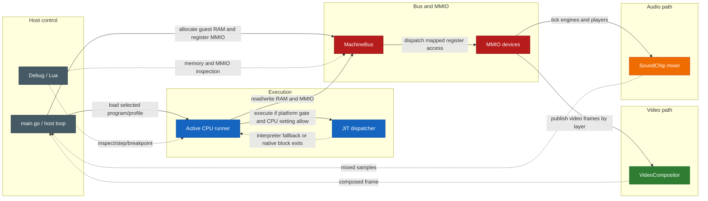

### Subsystem Matrix

| Subsystem | Runtime surface | Primary files | Wired registration / dispatch |
|-----------|-----------------|---------------|-------------------------------|
| CPU cores | IE32, IE64, M68K, Z80, 6502, x86 | `cpu_*.go`, `cpu_*_runner.go` | `main.go` selects runners by file extension, OS mode, or EXEC MMIO |
| JIT | IE64 on amd64/arm64; 6502, M68K, Z80, x86 on amd64 | `jit_dispatch.go`, `jit_6502_dispatch.go`, `jit_m68k_dispatch.go`, `jit_z80_dispatch.go`, `jit_x86_dispatch.go` | Build tags plus `runtime.GOARCH` gates; non-supported hosts use dispatch stubs |
| Bus and RAM | Host-sized guest RAM, profile clamps, MMIO, byte/64-bit handlers | `machine_bus.go`, `memory_sizing.go`, `profile_bounds.go`, `sysinfo_mmio.go` | `main.go` registers devices before execution; `MachineBus.SealMappings` prevents late maps |
| Video | VideoChip, VGA, TED video, ANTIC/GTIA, ULA, Voodoo | `video_chip.go`, `video_vga.go`, `video_ted.go`, `video_antic.go`, `video_ula.go`, `video_voodoo.go` | `main.go` maps each register/VRAM block and registers compositor layers 0/10/12/13/15/20 |
| Audio | SoundChip/SFX, PSG/AY, SN76489, SID x3, TED, POKEY/SAP, AHX, MOD, WAV | `audio_chip.go`, `sfx_trigger.go`, `psg_engine.go`, `sn76489_chip.go`, `sid_engine.go`, `ted_engine.go`, `pokey_engine.go`, `ahx_player.go`, `mod_player.go`, `wav_player.go` | `main.go` maps chip/player MMIO and registers sample tickers into SoundChip |
| OS integration | EmuTOS, AROS, GEMDOS/XBIOS, AROS DOS, Paula-style DMA | `emutos_loader.go`, `aros_loader.go`, `gemdos_intercept.go`, `aros_dos_intercept.go`, `aros_audio_dma.go` | OS modes install intercept MMIO and loader state during boot/reset |
| Tooling | Assemblers, disassembler, transpiler, generators | `assembler/`, `cmd/ie32to64/`, `cmd/gen_m68k_cputest/`, `cmd/gen_interp6502/` | Makefile builds SDK tools into `sdk/bin/` |

## Platform JIT Matrix

The host-side JIT support is intentionally asymmetric and follows the dispatch files, not emitter-file presence:

| Host platform | JIT-enabled guest cores | Dispatch authority |
|---------------|-------------------------|--------------------|
| Linux amd64 | IE64, 6502, M68K, Z80, x86 | `jit_dispatch.go`, amd64 per-core dispatch files |
| Linux arm64 | IE64 | `jit_dispatch.go`; Z80 dispatch compiles but keeps `z80JitAvailable` false |
| Windows amd64 | IE64, 6502, M68K, Z80, x86 | amd64 per-core dispatch files |
| Windows arm64 | IE64 | IE64 dispatch only; per-core non-IE64 stubs |
| macOS amd64 | IE64, 6502, M68K, Z80, x86 | amd64 per-core dispatch files |
| macOS arm64 | IE64 | IE64 dispatch plus Darwin arm64 JIT write-protect helpers |

On macOS amd64, the JIT reuses the shared x86-64 host backends. On macOS arm64, executable memory uses the native `MAP_JIT` model with thread-pinned write protection toggles, and non-IE64 guest cores remain interpreter-only on arm64 hosts.

## 3. CPU Subsystem

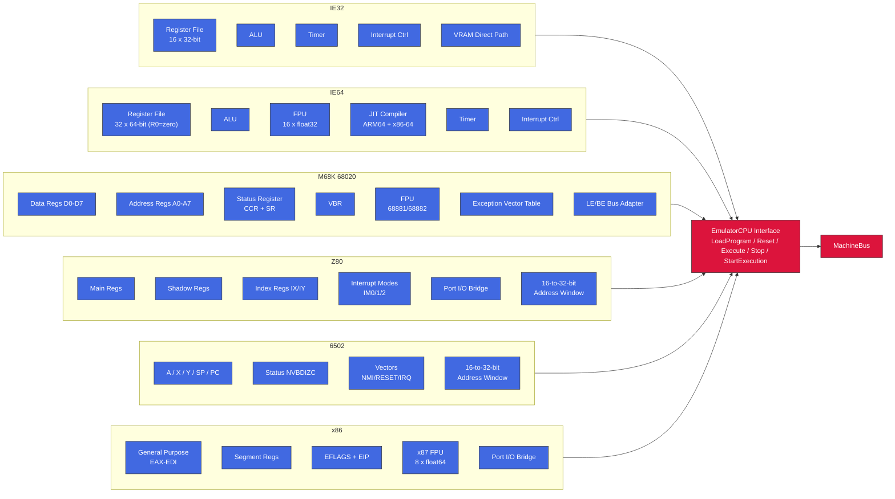

### CPU Timers (IE32 / IE64)

Both IE32 and IE64 use CPU-internal countdown timers backed by atomic fields on the CPU structs.

- The timer decrements once per `SAMPLE_RATE` instructions.
- On expiry, it sets timer state to expired and can trigger a CPU interrupt.
- If still enabled after interrupt handling, the count auto-reloads from the configured period.

There is no stable bus/MMIO timer control ABI at present. Legacy include symbols such as `TIMER_CTRL/TIMER_COUNT/TIMER_RELOAD` are retained for compatibility but are deprecated.

### CPU Selection by File Extension

| Extension | CPU | Address Space | Notes |
|-----------|-----|---------------|-------|
| `.iex` / `.ie32` | IE32 | 32-bit flat (clamped to active visible RAM) | Native RISC, 8-byte fixed instructions |
| `.ie64` | IE64 | 64-bit (sees full active visible RAM) | 64-bit RISC, R0=zero, JIT on ARM64 + x86-64 |
| `.ie68` | M68K | 32-bit flat (clamped to M68K profile bound) | 68020, big-endian with LE bus adapter |
| `.ie65` | 6502 | 16-bit + bank windows | Bank windows reach the banked-CPU visible ceiling |
| `.ie80` | Z80 | 16-bit + bank windows + port I/O bridge | Bank windows reach the banked-CPU visible ceiling |
| `.ie86` | x86 | 32-bit flat (clamped to active visible RAM) | Flat model, port I/O bridge |
| `.tos` / `.img` | M68K | EmuTOS profile (`EmuTOS_PROFILE_TOP`) | EmuTOS boot with GEMDOS intercept |
| `.ies` | Script | N/A | Lua scripting engine (IE Script) |

AROS boot is selected by CLI mode (`-aros`, optional `-aros-image`), not file extension.

### Z80 Port I/O Bridge

Z80 `IN`/`OUT` instructions are translated to bus MMIO accesses by the `Z80BusAdapter`:

| Z80 Port | Chip | Bus Target | Protocol |
|----------|------|------------|----------|
| `$A0-$AA` | VGA | `0xF1000` | Direct register map (MODE, STATUS, CTRL, SEQ, CRTC, GC, DAC) |
| `$B0-$B7` | Voodoo 3D | `0xF8000` | Addr lo/hi + 4 data bytes (write to `$B5` triggers 32-bit bus write) |
| `$D0/$D1` | POKEY | `0xF0D00` | Register select / data |
| `$D4/$D5` | ANTIC | `0xF2100` | Register select / data (x4 stride) |
| `$D6/$D7` | GTIA | `0xF2140` | Register select / data (x4 stride, collision regs through `0xF21F8`) |
| `$E0/$E1` | SID | `0xF0E00/0xF0E30/0xF0E50` | Register select / data; select bits 5-6 choose SID1/SID2/SID3 |
| `$F0/$F1` | PSG | `0xF0C00` | Register select / data |
| `$F2/$F3` | TED | `0xF0F00` / `0xF0F20` | Register select / data (audio / video x4 stride) |
| `$FE` | ULA | `0xF2000` | Border colour (bits 0-2). Bits 3-4 currently ignored. |

### Z80 16-bit Memory Translation

Z80 memory accesses in `0xF000-0xFFFF` are translated to bus `0xF0000-0xF0FFF`. ANTIC/GTIA access is provided through the Z80 port bridge (`$D4-$D7`) rather than general memory-mapped addressing.

### x86 Port I/O Bridge

x86 shares the Z80 Voodoo port mapping (`$B0-$B7`) and most sound-chip port mappings, but **POKEY uses direct port-to-register mapping** (not the Z80's select/data protocol). It also adds standard PC VGA ports:

| x86 Port | Chip | Bus Target | Protocol |
|----------|------|------------|----------|
| `$3C4` | VGA Sequencer index | `VGA_SEQ_INDEX` | Standard PC port |
| `$3C5` | VGA Sequencer data | `VGA_SEQ_DATA` | Standard PC port |
| `$3C6-$3C9` | VGA DAC | mask / read idx / write idx / data | R/G/B cycled in sequence |
| `$3CE` | VGA GC index | `VGA_GC_INDEX` | Standard PC port |
| `$3CF` | VGA GC data | `VGA_GC_DATA` | Standard PC port |
| `$3D4` | VGA CRTC index | `VGA_CRTC_INDEX` | Standard PC port |
| `$3D5` | VGA CRTC data | `VGA_CRTC_DATA` | Standard PC port |
| `$3DA` | VGA Status | Returns `0x08` if vsync | Standard PC port |
| `$B0-$B7` | Voodoo 3D | `0xF8000` | Addr lo/hi + 4 data bytes |
| `$60-$69` | POKEY | `0xF0D00+(port-0x60)` | **Direct** - port offset maps to writable register |
| `$D4/$D5` | ANTIC | `0xF2100` | Register select / data (x4 stride) |
| `$D6/$D7` | GTIA | `0xF2140` | Register select / data (x4 stride, collision regs through `0xF21F8`) |
| `$E0/$E1` | SID | `0xF0E00/0xF0E30/0xF0E50` | Register select / data; select bits 5-6 choose SID1/SID2/SID3 |
| `$F0/$F1` | PSG | `0xF0C00` | Register select / data |
| `$F2/$F3` | TED | `0xF0F00` / `0xF0F20` | Register select / data (audio / video x4 stride) |
| `$FE` | ULA | `0xF2000` | Border colour (bits 0-2) |

**Key difference from Z80**: x86 POKEY access is direct - ports `$60-$69` map one-to-one onto writable POKEY registers at `0xF0D00+(port-0x60)`. ANTIC (`$D4/$D5`) and GTIA (`$D6/$D7`) keep their own select/data pairs.

x86 also directly accesses VGA VRAM at `$A0000-$AFFFF` in the memory path (no port translation needed).

### Bank Windows (Z80 / 6502 / x86)

All three 8/16-bit CPUs share identical bank window architecture for accessing the active visible RAM from a 16-bit address space; bank translation rejects addresses above the banked-CPU visible ceiling:

| CPU Address | Size | Purpose | Bank Select Register |
|-------------|------|---------|---------------------|
| `$2000-$3FFF` | 8KB | Bank 1 (sprite data) | `$F700/$F701` (lo/hi) |
| `$4000-$5FFF` | 8KB | Bank 2 (font data) | `$F702/$F703` (lo/hi) |
| `$6000-$7FFF` | 8KB | Bank 3 (general) | `$F704/$F705` (lo/hi) |
| `$8000-$BFFF` | 16KB | VRAM window | `$F7F0` (bank number) |
| `$F000-$FFF9` | 4KB | I/O window | Hardwired: `$Fxxx` -> bus `$F0xxx` |
| `$F200-$F23F` | 64B | Coprocessor gateway | Hardwired: -> bus `$F2340+offset` |
| `$FFFA-$FFFF` | 6B | 6502 vectors (NMI/RESET/IRQ) | Identity mapped |

### 6502 I/O Chip Page Dispatch

The 6502 uses `ioTable[page]` to route memory-mapped I/O through the bus:

| 6502 Address | Chip | Bus Target | Notes |
|--------------|------|------------|-------|
| `$D200-$D209` | POKEY | `0xF0D00+offset` | |
| `$D400-$D40F` | PSG | `0xF0C00+offset` | |
| `$D500-$D51F` | SID1 | `0xF0E00+offset` | 32-byte window |
| `$D520-$D53F` | SID2 | `0xF0E30+offset` | 32-byte window |
| `$D540-$D55F` | SID3 | `0xF0E50+offset` | 32-byte window |
| `$D600-$D605` | TED Audio | `0xF0F00+offset` | |
| `$D620-$D62F` | TED Video | `0xF0F20+offset x4` | Stride-4 register mapping |
| `$D700-$D70A` | VGA | `0xF1000` | Direct handler call |
| `$D800-$D817` | ULA | `0xF2000+offset` | Registers plus paged VRAM data port |

ANTIC/GTIA intentionally has no 6502 `$D400/$D000` compatibility surface; `$D400-$D40F` is PSG on the 6502 map.

## 4. Video Subsystem

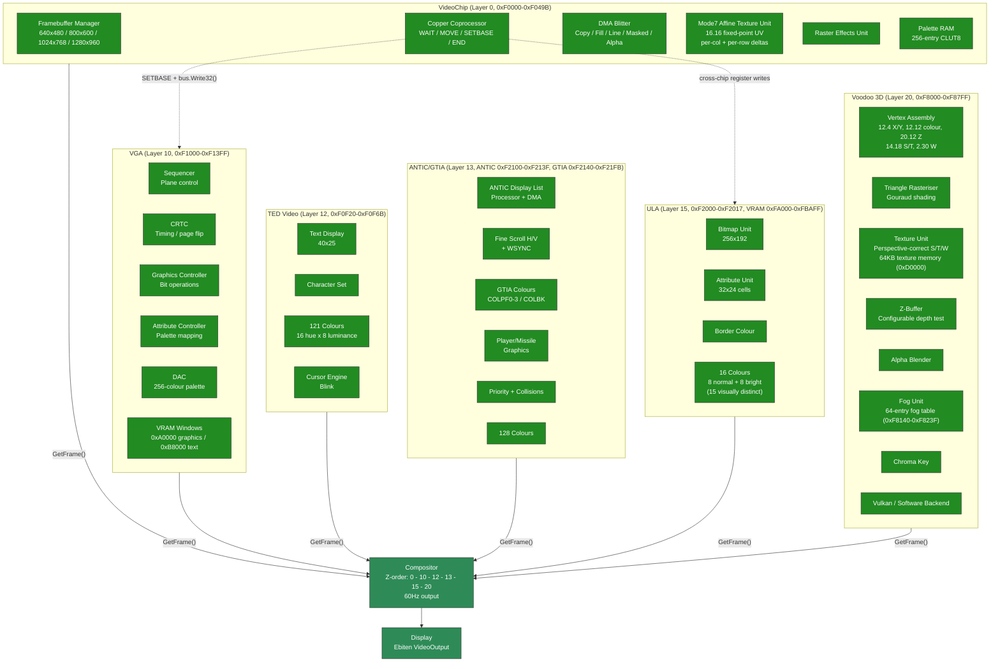

### Copper Cross-Chip Bus Access

The copper coprocessor is internal to VideoChip but can write to any MMIO-mapped chip on the bus:

- **Default**: MOVE targets VideoChip's own registers (`copperIOBase = VIDEO_REG_BASE`)
- **SETBASE opcode** changes `copperIOBase` to any MMIO address (e.g. `VGA_BASE 0xF1000`)
- Subsequent MOVE instructions compute `regAddr = copperIOBase + (regIndex * 4)` and route via `bus.Write32()` to VGA, ULA, or any other chip's MMIO
- This enables per-scanline palette changes, mode switches, and register manipulation on any video chip
- `copperIOBase` resets to `VIDEO_REG_BASE` at the start of each frame
- The compositor's `ScanlineAware` interface orchestrates this: `StartFrame()` -> `ProcessScanline(y)` -> `FinishFrame()`

### Extended Blitter: BPP Modes, Draw Modes, and Color Expansion

The blitter supports two pixel formats via `BLT_FLAGS` (`0xF0488`): RGBA32 (4 bpp, default) and CLUT8 (1 bpp). Bits 4-7 select one of 16 raster draw modes (Clear, And, Copy, Xor, Invert, etc.) applied per pixel during FILL and COPY operations. `BLT_OP=4` performs source-over alpha blending with source alpha in bits 31-24 using `out = (src*a + dst*(255-a))/255`. When `BLT_FLAGS=0`, the blitter defaults to Copy mode with RGBA32 for full backward compatibility.

`BLT_CTRL` bit 0 starts the synchronous blit, bit 1 is read-only busy, and bit 2 enables a completion pulse on `IntMaskBlitter`. `BLT_STATUS` bit 0 is ERR, bit 1 is DONE, and bit 2 is sticky IRQ_PENDING (write 1 to clear). Invalid opcodes, out-of-range Mode7 samples, and overflowed blitter bounds set ERR and do not silently fall back to COPY.

The color expansion operation (`BLT_OP=6`) renders 1-bit glyph templates into colored pixels for hardware-accelerated text. It reads a template from `BLT_MASK`, uses `BLT_FG`/`BLT_BG` (`0xF048C`/`0xF0490`) as foreground/background colors, and supports three modes: JAM2 (opaque - set bits write FG, clear bits write BG), JAM1 (transparent - only set bits write FG), and Invert (set bits XOR the destination). `BLT_MASK_MOD` (`0xF0494`) sets the template row stride and `BLT_MASK_SRCX` (`0xF0498`) provides sub-byte bit alignment for glyph fragments. Template bits are MSB-first (Amiga convention).

Line drawing (`BLT_OP=2`) supports an extended mode when `BLT_FLAGS != 0`: `BLT_DST` becomes the framebuffer base address, `BLT_WIDTH` holds the packed endpoint coordinates `(y1<<16)|x1`, and `BLT_DST_STRIDE` sets the row stride. This allows line drawing into arbitrary bitmaps (not just the active framebuffer) with BPP awareness and all 16 draw modes. When `BLT_FLAGS=0`, legacy behavior is preserved (endpoint in `BLT_DST`, base at `VRAM_START`). In extended mode the blitter does not clip - callers must provide pre-clipped coordinates (the AROS driver uses Cohen-Sutherland clipping before calling the blitter).

| Register | Address | Description |
|----------|---------|-------------|
| `BLT_FLAGS` | `0xF0488` | BPP (bits 0-1), draw mode (bits 4-7), JAM1/invert flags (bits 8-10) |
| `BLT_FG` | `0xF048C` | Foreground color for color expansion |
| `BLT_BG` | `0xF0490` | Background color for color expansion |
| `BLT_MASK_MOD` | `0xF0494` | Template row modulo (bytes per row) |
| `BLT_MASK_SRCX` | `0xF0498` | Starting X bit offset in template |

### Mode7 Affine Texture Unit

The blitter's Mode7 operation (`bltOpMode7`) implements SNES-style affine texture mapping as a DMA blitter mode within VideoChip. It uses 8 dedicated MMIO registers (`0xF0058-0xF0074`):

| Register | Address | Description |
|----------|---------|-------------|
| `BLT_MODE7_U0` | `0xF0058` | Starting U coordinate (16.16 fixed-point) |
| `BLT_MODE7_V0` | `0xF005C` | Starting V coordinate (16.16 fixed-point) |
| `BLT_MODE7_DU_COL` | `0xF0060` | U increment per column (16.16) |
| `BLT_MODE7_DV_COL` | `0xF0064` | V increment per column (16.16) |
| `BLT_MODE7_DU_ROW` | `0xF0068` | U increment per row (16.16) |
| `BLT_MODE7_DV_ROW` | `0xF006C` | V increment per row (16.16) |
| `BLT_MODE7_TEX_W` | `0xF0070` | Texture width mask (must be power-of-2 minus 1) |
| `BLT_MODE7_TEX_H` | `0xF0074` | Texture height mask (must be power-of-2 minus 1) |

The rasteriser walks each destination pixel, computes the source UV from the affine matrix (origin + column delta + row delta), wraps via power-of-2 bitmask, and samples the source texture. This enables rotation, scaling, and perspective-like effects on tiled backgrounds - the same technique used by the SNES PPU2 for its Mode 7 background layer.

### Video Compositor

The compositor collects immutable frame snapshots from all enabled video sources and blends them in Z-order (layer 0 at the back, layer 20 at the front). For IEVideoChip CLUT8 mode, both mapped VRAM and direct bus-backed VRAM are converted through the palette before compositing.

Two rendering paths:

1. **Scanline-aware path** - used when at least one enabled source implements `ScanlineAware`. The compositor advances scanline-capable sources in sorted layer order for each scanline, then blends all enabled sources in the global layer order. Opaque full-frame sources can sit below, between, or above scanline-aware sources without breaking copper/VGA per-scanline effects.
2. **Full-frame fallback** - used when no enabled source is scanline-aware. It collects complete frames and blends them in sorted layer order. Same-size frame blending uses parallel goroutines with 60-line strips via `sync.WaitGroup`.

Frame alpha is currently an alpha-mask test: alpha 0 is transparent and any nonzero alpha overwrites the destination. The compositor tick remains fixed at 60 Hz for guest VBlank compatibility; `GetRefreshRate()` reports the output backend rate, while `GetTickRate()` reports the compositor tick.

### Triple-Buffer Protocol

All video systems except VideoChip use a lock-free triple-buffer protocol for `GetFrame()`:

```text
Slots:  writeIdx = 0 (producer-owned)
        sharedIdx = 1 (atomic, in-transit)
        readingIdx = 2 (consumer-owned)

Producer (render goroutine, after rendering into frameBufs[writeIdx]):
    writeIdx = sharedIdx.Swap(writeIdx)

Consumer (compositor, GetFrame):
    readIdx = sharedIdx.Swap(readIdx)
    return frameBufs[readIdx]
```

**Important**: `GetFrame()` performs an atomic Swap - calling it twice in a row swaps back to the previous buffer. Always call once and save the result.

On resolution change, all 3 buffer slots are reallocated and indices reset to `writeIdx=0`, `sharedIdx=1`, `readingIdx=2`.

## 5. Audio Subsystem

### Synthesis Pipeline

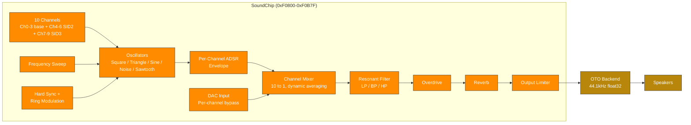

### SoundChip Dual-Interface Architecture

The SoundChip exposes two register interfaces for its channels:

**Legacy per-waveform interface** (`0xF0900-0xF09FF`) - 5 dedicated register blocks, each hardwired to one waveform type:

| Range | Channel | Default Waveform |
|-------|---------|-----------------|
| `0xF0900-0xF093F` | Ch 0 | Square |
| `0xF0940-0xF097F` | Ch 1 | Triangle |
| `0xF0980-0xF09BF` | Ch 2 | Sine |
| `0xF09C0-0xF09FF` | Ch 3 | Noise |
| `0xF0A00-0xF0A6F` | - | Sawtooth + modulation/effects |

**FLEX unified interface** (`0xF0A80-0xF0B7F`) - 4 channels with identical 64-byte register blocks. Each channel can be any waveform type:

| Offset | Register | Description |
|--------|----------|-------------|
| `+0x00` | `FREQ` | 16.8 fixed-point Hz (value / 256.0) |
| `+0x04` | `VOL` | Volume (0-255) |
| `+0x08` | `CTRL` | Enable (bit 0), gate (bit 1) |
| `+0x0C` | `DUTY` | Pulse width duty cycle; high byte is PWM depth scaled by 1/256 |
| `+0x10` | `SWEEP` | Frequency sweep rate |
| `+0x14-0x20` | `ATK/DEC/SUS/REL` | ADSR envelope |
| `+0x24` | `WAVE_TYPE` | Waveform selection |
| `+0x28` | `PWM_CTRL` | Pulse width modulation |
| `+0x2C` | `NOISEMODE` | Noise mode (0=white, 1=periodic, 2=metallic, 3=psg) |
| `+0x30` | `PHASE` | Phase reset |
| `+0x34` | `RINGMOD` | Ring modulation (bit 7=enable, 0-2=source) |
| `+0x38` | `SYNC` | Hard sync (bit 7=enable, 0-2=source) |
| `+0x3C` | `DAC` | DAC mode bypass (signed 8-bit sample, -128=-1.0, +127=+1.0) |

FLEX channels are at `FLEX_CH0_BASE = 0xF0A80`, stride = `0x40`. Primary channels 0-3 occupy `0xF0A80-0xF0B7F`; SID2 flex channels 4-6 occupy `0xF0C40-0xF0CFF`; SID3 flex channels 7-9 occupy `0xF0D40-0xF0DFF`. `AUDIO_CTRL` uses bit 0 for enable and bit 1 for freeze. `ENV_SHAPE` remains at `0xF0804` for channel 0, with per-channel shapes at `0xF0860 + channel*4`. Both legacy and FLEX interfaces write to the same underlying 10-channel mixer. The FLEX interface is preferred for new code - the legacy interface exists for backward compatibility.

### Filter and Modulation

The SoundChip's global resonant filter (`0xF0A00-0xF0A30`) supports low-pass, band-pass, and high-pass modes with cutoff frequency, resonance, and optional filter modulation source/amount registers. Cutoff and resonance smooth toward register targets at the same 0.02 coefficient used by per-channel filters. SID 12-bit DAC quantization truncates to remove half-LSB DC bias.

### Engine and Player Routing

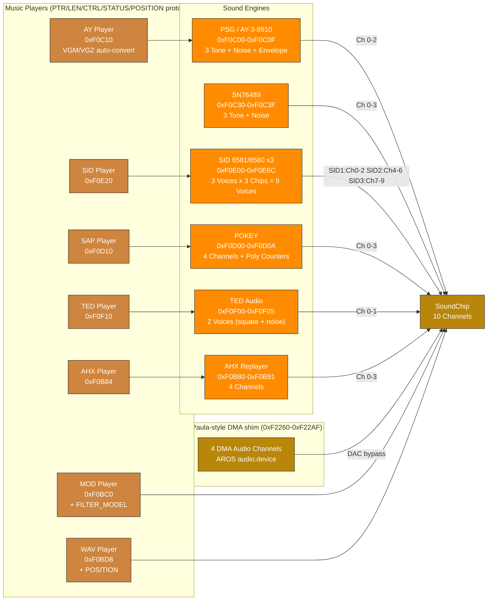

### Audio Engine Plus Enhanced Mode

All five classic-style sound engines have a "Plus" enhanced mode, activated by writing `1` to their respective `PLUS_CTRL` register:

| Engine | PLUS_CTRL Address | Enhancements |
|--------|-------------------|--------------|
| PSG+ | `0xF0C20` | Enhanced render path: oversampling, filtering, drive/room shaping, stereo voicing |
| SID+ | `0xF0E19` | Enhanced render path for SID voices (oversampling/filter/drive/room shaping) |
| POKEY+ | `0xF0D09` | Enhanced render path (oversampling/filter/drive/room shaping) |
| TED+ | `0xF0F05` | Enhanced render path plus TED-specific response shaping |
| AHX+ | `0xF0B80` | AHX voice-state mapping with stereo spread/panning and room processing |

The PSG uses the AY/YM logarithmic 16-step volume curve by default. A legacy linear curve is retained only for compatibility audits.

When Plus mode is enabled, the engine retains full backward compatibility with the standard register set while exposing additional capabilities. AHX maps tracker state to native SoundChip channels instead of producing an AROS audio DMA stream; AHX+ uses a 64-sample crossfade when enabling/disabling to prevent audio glitches.

### AROS Paula-Style DMA Shim ABI

The AROS audio block at `0xF2260-0xF22AF` is an Intuition Engine shim for AROS `audio.device`, not a full Amiga Paula implementation.

- Guest code writes the shim with 32-bit aligned writes (`MOVE.L`). Narrower writes are outside the current ABI.
- A `DMACON` channel transition from `0` to `1` latches that channel's pointer, length, period, and volume. Active playback uses the latched values until the buffer ends.
- If the latched period or length is zero at arm time, the channel is not activated. The channel `DMACON` bit is cleared, the status bit is set, and a level-3 interrupt is raised when the corresponding `INTENA` bit is set.
- Buffer exhaust sets the status bit, raises a level-3 interrupt when the corresponding `INTENA` bit is set, marks the channel inactive, and clears that channel's `DMACON` bit. The guest must write `DMACON` enable again to start the next buffer.
- Out-of-range pointers beyond the active AROS profile RAM deactivate the channel, mute the DAC output, set the status bit, and raise a level-3 interrupt when the corresponding `INTENA` bit is set.
- Pointer writes ignore bit 0, length is a word count and preserves odd values, period writes with zero are ignored, and volume writes are clamped to `0..64`.

### Subsong Selection

SID, SAP, and AHX players support subsong selection for multi-tune files. Each player has a subsong register that selects which tune to play from a multi-song file.

SID PSID playback captures CIA1 timer-A latch writes at `$DC04/$DC05`; when non-zero, the player uses that latch as `cyclesPerTick`, so multispeed tunes run at `clockHz / latch`. SID MMIO opts into wide-write fanout: 16-bit and 32-bit writes are decomposed into little-endian byte register writes.

## 6. Memory Map

| Range | Size | Device |
|-------|------|--------|
| `0x00000-0x9EFFF` | 636KB | Main RAM |
| `0x9F000-0x9FFFF` | 4KB | Stack |
| `0xA0000-0xAFFFF` | 64KB | VGA VRAM Window |
| `0xB8000-0xBFFFF` | 32KB | VGA Text Buffer |
| `0xF0000-0xF049B` | 1180B | VideoChip + Copper + Blitter + Palette + extended blitter |
| `0xF0700-0xF07FF` | 256B | Terminal / Serial / Mouse / Keyboard / RTC_EPOCH (0xF0750) |
| `0xF0800-0xF0B7F` | 896B | SoundChip (10 channels, incl. FLEX) |
| `0xF0B80-0xF0B91` | 18B | AHX Engine / Player |
| `0xF0BC0-0xF0BD7` | 24B | MOD Player |
| `0xF0BD8-0xF0BF3` | 28B | WAV Player |
| `0xF0C00-0xF0C0F` | 16B | PSG Engine (AY-3-8910/YM2149 registers) |
| `0xF0C10-0xF0C1F` | 16B | PSG / AY Player |
| `0xF0C20` | 1B | PSG+ control |
| `0xF0C30-0xF0C3F` | 16B | Native SN76489 latch/data, ready, and LFSR mode registers |
| `0xF0C40-0xF0CFF` | 192B | SID2 flex-style SoundChip channels 4-6 |
| `0xF0D00-0xF0D0A` | 11B | POKEY Engine |
| `0xF0D10-0xF0D20` | 17B | SAP Player |
| `0xF0D40-0xF0DFF` | 192B | SID3 flex-style SoundChip channels 7-9 |
| `0xF0E00-0xF0E19` | 26B | SID1 Engine (6581/8580) |
| `0xF0E20-0xF0E2D` | 14B | SID Player |
| `0xF0E30-0xF0E6C` | 61B | SID2 + SID3 (Multi-SID) |
| `0xF0E80-0xF0EFF` | 128B | SoundChip SFX trigger channels |
| `0xF0F00-0xF0F05` | 6B | TED Audio Engine |
| `0xF0F10-0xF0F1C` | 13B | TED Player |
| `0xF0F20-0xF0F6B` | 76B | TED Video |
| `0xF1000-0xF13FF` | 1KB | VGA Registers |
| `0xF2000-0xF2017` | 24B | ULA Registers |
| `0xFA000-0xFBAFF` | 6912B | ULA VRAM Aperture |
| `0xF2100-0xF213F` | 64B | ANTIC |
| `0xF2140-0xF21FB` | 188B | GTIA |
| `0xF2200-0xF221F` | 32B | File I/O |
| `0xF2220-0xF225F` | 64B | AROS DOS Handler |
| `0xF2260-0xF22AF` | 80B | AROS Paula-style DMA shim |
| `0xF2300-0xF231F` | 32B | Media Loader |
| `0xF2320-0xF233F` | 32B | Program Executor |
| `0xF2340-0xF238F` | 80B | Coprocessor Manager |
| `0xF2390-0xF23AF` | 32B | Clipboard Bridge |
| `0xF23B0-0xF23BF` | 16B | Coprocessor Extended (monitor registers) |
| `0xF23C0-0xF23DF` | 32B | IRQ diagnostic registers |
| `0xF23E0-0xF23FF` | 32B | Bootstrap HostFS |
| `0xF2400-0xF24FF` | 256B | SYSINFO RAM-size discovery |
| `0xF8000-0xF87FF` | 2KB | Voodoo 3D Registers + palette |
| `0xF8140-0xF823F` | 256B | Voodoo Fog Table (64 entries × 4B) |
| `0xD0000-0xDFFFF` | 64KB | Voodoo Texture Memory |
| `0x100000-0x5FFFFF` | 5MB | Video RAM |
| `0x800000-0x1DFFFFF` | 22MB | AROS Fast Memory |
| `0x1E00000-0x1FFFFFF` | 2MB | AROS Video RAM |

Additional special regions used by the coprocessor subsystem:

| Range | Size | Purpose |
|-------|------|---------|
| `0x200000-0x27FFFF` | 512KB | Coprocessor: IE32 worker memory |
| `0x280000-0x2FFFFF` | 512KB | Coprocessor: M68K worker memory |
| `0x300000-0x30FFFF` | 64KB | Coprocessor: 6502 worker memory |
| `0x310000-0x31FFFF` | 64KB | Coprocessor: Z80 worker memory |
| `0x320000-0x39FFFF` | 512KB | Coprocessor: x86 worker memory |
| `0x3A0000-0x41FFFF` | 512KB | Coprocessor: IE64 worker memory |
| `0x800000` | 64KB | Media loader staging buffer |
| `0x790000-0x7917FF` | 6KB | Coprocessor mailbox ring buffers |

## 7. I/O Peripherals

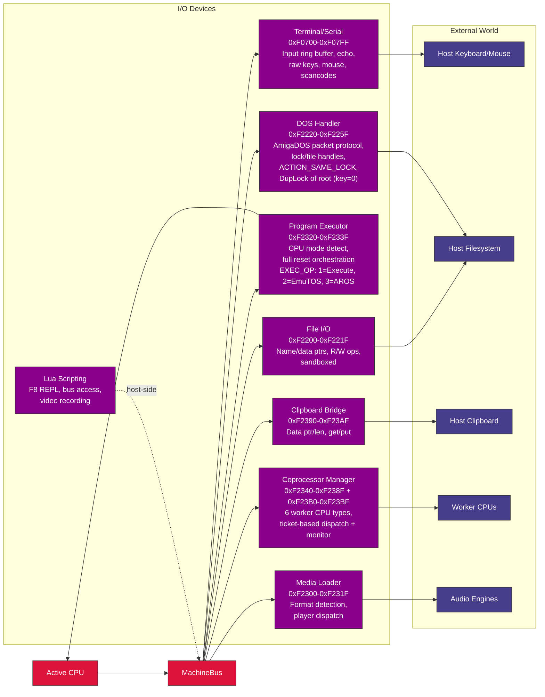

### Coprocessor Worker Dispatch

The coprocessor manager supports 6 worker CPU types (IE32, IE64, 6502, M68K, Z80, x86) with ticket-based job dispatch and mailbox ring buffers at `0x790000`. Each worker type has its own dedicated memory region (see memory map above). The main CPU enqueues work via MMIO writes; workers execute independently and post results back through their mailbox slots. When `COPROC_IRQ_CTRL` bit 0 is set, the coprocessor fires a Level 6 completion interrupt (INTB_COPER) on job completion, with the finished ticket ID readable from `COPROC_COMPLETED_TICKET`.

### Lua Scripting

The Lua scripting engine (`script_engine.go`) runs in its own goroutine and provides host-side access to the entire bus. It supports an F8 REPL for interactive debugging, video recording, and direct chip register manipulation. Scripts use the `.ies` extension and are loaded via the IE Script Engine.

## 8. Data Flow

### Video Pipeline

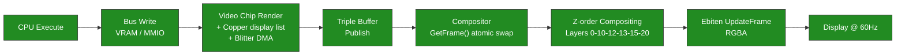

### Audio Pipeline

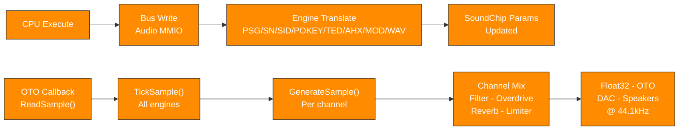

### CPU Mode Switching


## 9. Concurrency Model and System Timing

### Goroutine Inventory

| Goroutine | Clock Source | Rate | Synchronisation |
|-----------|-------------|------|-----------------|
| CPU execution | Free-running `for running.Load()` loop | As fast as Go scheduler allows | MMIO writes invoke I/O callbacks under per-chip `mu` |
| VideoChip refresh | `time.NewTicker` | 60Hz | Copper + blitter + dirty-tile copy + buffer swap |
| VGA render | `time.NewTicker` | 60Hz | Renders into triple-buffer slot, publishes via `sharedIdx.Swap()` |
| ULA render | `time.NewTicker` | 60Hz | Same triple-buffer pattern |
| TED render | `time.NewTicker` | 60Hz | Same triple-buffer pattern |
| ANTIC render | `time.NewTicker` | 60Hz | Same triple-buffer pattern |
| Compositor | `time.NewTicker` | 60Hz | Calls `GetFrame()` (atomic swap) on each source, blends, sends to display |
| OTO audio thread | Host audio hardware callback | 44.1kHz | Calls `SoundChip.ReadSample()` -> `GenerateSample()` directly |
| Terminal output | `time.NewTicker` | 100Hz | Flushes output buffer to host terminal |
| Coprocessor workers | On-demand | Varies | Independent CPUs with mailbox ring buffers |
| Script engine | Event-driven | Varies | Lua goroutine with frame-sync channel |

### Three Independent Clocks

```text
CPU:   Free-running (no fixed clock -- instruction throughput varies with host speed)
Video: 6 video sources plus compositor tick at 60Hz; non-VideoChip sources use lock-free triple-buffer handoff
Audio: OTO hardware callback drives sample generation at 44.1kHz -- no IE-owned goroutine
```

### Synchronisation Model

**Hot paths** (lock-free):
- `atomic.Bool` - CPU `running`, chip `enabled`, `compositorManaged`
- `atomic.Int32` - triple-buffer `sharedIdx`
- `atomic.Pointer` - selected CPU pointer

**Cold paths** (mutex-protected):
- `sync.Mutex` (`chip.mu`, `video.mu`) - configuration changes, setup, stop

**CPU-to-Video**:
- CPU writes to VRAM/MMIO invoke I/O callbacks under per-chip `mu`
- Video chips read VRAM lock-free (snapshot-render pattern: copy under lock, render without lock)

**CPU-to-Audio**:
- CPU writes to audio MMIO update channel parameters under `chip.mu`
- OTO callback reads parameters atomically or under `chip.mu` for `GenerateSample()`

**No CPU-video vsync coupling**:
- CPU runs ahead freely - no wait-for-vblank blocking
- WAIT register polls `vblankActive atomic.Bool` without blocking the CPU

## Appendix: Key Source Files

| File | Role |
|------|------|
| `registers.go` | Master I/O address map - all region boundaries |
| `machine_bus.go` | MachineBus: autodetected guest RAM, MapIO, ioPageBitmap, Read/Write, SYSINFO accessors |
| `memory_sizing.go` | Boot-time guest RAM autodetection: total guest RAM + active visible RAM with platform reserves |
| `profile_bounds.go` | Source-owned profile bounds for EmuTOS, AROS, EhBASIC |
| `emulator_cpu.go` | EmulatorCPU interface definition |
| `video_interface.go` | VideoSource, VideoOutput, ScanlineAware interfaces |
| `video_compositor.go` | Compositor pipeline, Z-order blending |
| `video_chip.go` | VideoChip + Copper + Blitter + Palette |
| `video_vga.go` | VGA engine (Sequencer, CRTC, GC, AC, DAC) |
| `video_ula.go` | ULA engine (Spectrum display) |
| `video_ted.go` | TED video engine |
| `video_antic.go` | ANTIC + GTIA engines |
| `video_voodoo.go` | Voodoo 3D pipeline |
| `audio_chip.go` | SoundChip (10-channel synthesis) |
| `psg_engine.go` | PSG / AY-3-8910 |
| `sn76489_chip.go` | SN76489 programmable sound generator |
| `sid_engine.go` | SID 6581/8580 |
| `pokey_engine.go` | POKEY |
| `ted_engine.go` | TED audio |
| `ahx_engine.go` | AHX replayer |
| `mod_player.go` | MOD player |
| `wav_player.go` | WAV player |
| `cpu_ie32.go` | IE32 CPU |
| `cpu_ie64.go` | IE64 CPU + interpreter |
| `fpu_ie64.go` | IE64 FPU (16 x float32) |
| `jit_emit_arm64.go` | IE64 JIT ARM64 emitter |
| `jit_emit_amd64.go` | IE64 JIT x86-64 emitter |
| `cpu_m68k.go` | M68K 68020 |
| `fpu_m68881.go` | M68881 FPU (8 x float64) |
| `cpu_z80.go` | Z80 |
| `cpu_z80_runner.go` | Z80 bus adapter, port I/O bridge, bank windows |
| `cpu_six5go2.go` | 6502 + bus adapter, ioTable dispatch, bank windows |
| `cpu_x86.go` | x86 |
| `cpu_x86_runner.go` | x86 bus adapter, port I/O bridge (PC VGA + shared ports) |
| `fpu_x87.go` | x87 FPU (8 x float64 stack) |
| `terminal_io.go` | Terminal / Serial / Mouse / Keyboard |
| `file_io.go` | File I/O |
| `program_executor.go` | Program Executor |
| `coprocessor_manager.go` | Coprocessor Manager |
| `clipboard_bridge.go` | Clipboard Bridge |
| `media_loader.go` | Media format detection + player dispatch |
| `script_engine.go` | Lua scripting engine |
| `aros_loader.go` | AROS ROM boot manager |
| `aros_dos_intercept.go` | AmigaDOS packet handler (MMIO) |
| `aros_audio_dma.go` | AROS Paula-style DMA shim |

## 10. IntuitionOS Hardening Story

IntuitionOS runs inside the IE64 virtual machine, so the security model has
two sides: the **guest** (IE64 MMU + `iexec.library` microkernel) and
the **host** (the Go engine process that executes the guest and
its JIT output). M15.4 closed the major guest-side gaps; M15.6
extends both sides so nothing the kernel relies on is contradicted
by the engine one layer down.

- **Guest W^X** - every page is exclusively writable or executable
  (see `IE64_ISA.md` §12.10). Code pages map `P|R|X`, data pages
  map `P|R|W`, `PTE.X` and `PTE.W` are never set together.
- **Host W^X** - as of M15.6 the JIT memory region is dual-mapped
  (see `IE64_JIT.md`). The writable view (`PROT_READ|PROT_WRITE`)
  is where `ExecMem.Write` and `PatchRel32At` emit bytes; the
  execution view (`PROT_READ|PROT_EXEC`) is the VA the JIT
  dispatcher jumps to. At no point does any host mapping hold
  both write and execute permission. Prior releases mapped the
  region RWX permanently; that contradiction with the guest W^X
  story is resolved.
- **SMEP / SMAP equivalent** - the IE64 MMU gained `SKEF` and
  `SKAC` bits in M15.6. `SKEF` stops supervisor instruction fetch
  from user-accessible pages (`FAULT_SKEF`). `SKAC` stops
  supervisor data access to user pages (`FAULT_SKAC`) unless the
  kernel has explicitly opened a supervisor-user-access window
  via the `SUAEN` privileged opcode. See `IE64_ISA.md` §12.2.1
  for the complete model.
- **User↔kernel copy contract** - kernel touches of user memory
  are funnelled through named helpers (`copy_from_user`,
  `copy_to_user`, `copy_cstring_from_user`) that bracket every
  access in `SUAEN` / `SUADIS`. Any missed call site faults with
  `FAULT_SKAC` and is loud rather than silent. See
  `IE64_COOKBOOK.md` for the worked idiom and anti-patterns.
- **Trap-frame stack** - nested-trap state (`CR_FAULT_PC`,
  `CR_FAULT_ADDR`, `CR_FAULT_CAUSE`, `CR_PREV_MODE`,
  `CR_SAVED_SUA`) is preserved by the CPU across trap entry and
  ERET so kernel handlers survive a nested synchronous trap
  without a manual MFCR/MTCR save/restore dance. See
  `IE64_ISA.md` §12.14.
- **Stack guard pages** - as of R1 in M15.6, both user stacks and
  the kernel stack reserve one unmapped page below the downward-growing
  stack floor. Overflow is therefore a deterministic `FAULT_NOT_PRESENT`
  instead of silent adjacent-page corruption.
- **Heap guard pages** - as of R2 in M15.6, `AllocMem(MEMF_GUARD)`
  reserves one unmapped page on each side of the mapped allocation.
  The per-task VA allocator treats those guard slots as occupied for the
  life of the region, so a neighboring allocation cannot consume them.
- **Cross-task confidentiality** - private and shared allocator
  pages are zeroed on free before release, so a later owner cannot
  observe prior-task bytes. `MapShared` then narrows consumer-side
  access further with an explicit permission bitmask. See
  `sdk/docs/IntuitionOS/M15.6-plan.md`.

The hardening story is layered rather than siloed: what the guest
kernel enforces (W^X, per-task quotas, exit-time sweeps,
permission-preserving shared mappings) and what the host enforces
(JIT W^X, bootstrap hostfs confinement) are complementary, and
each item has a regression test that fails loudly if the invariant
is dropped.
