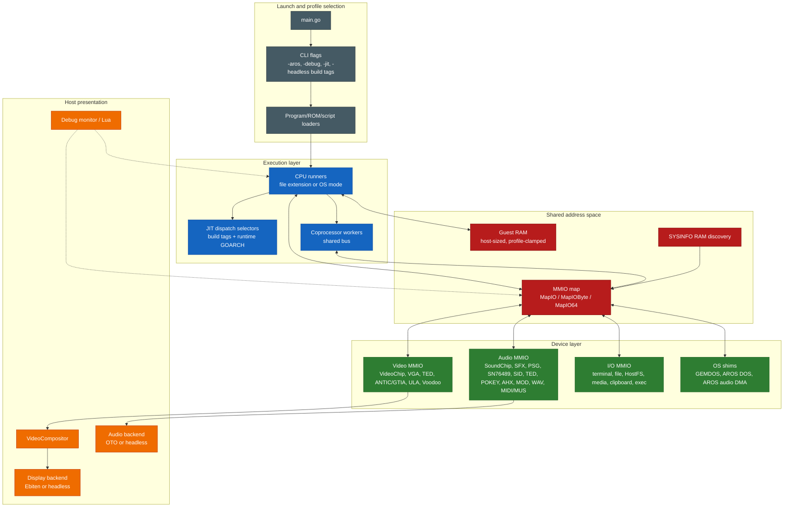
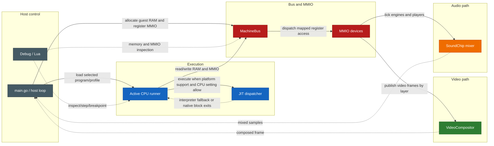
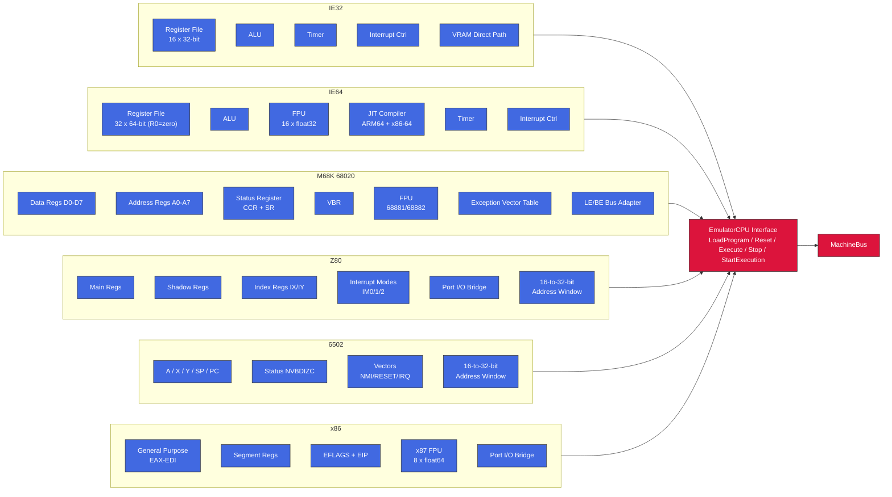
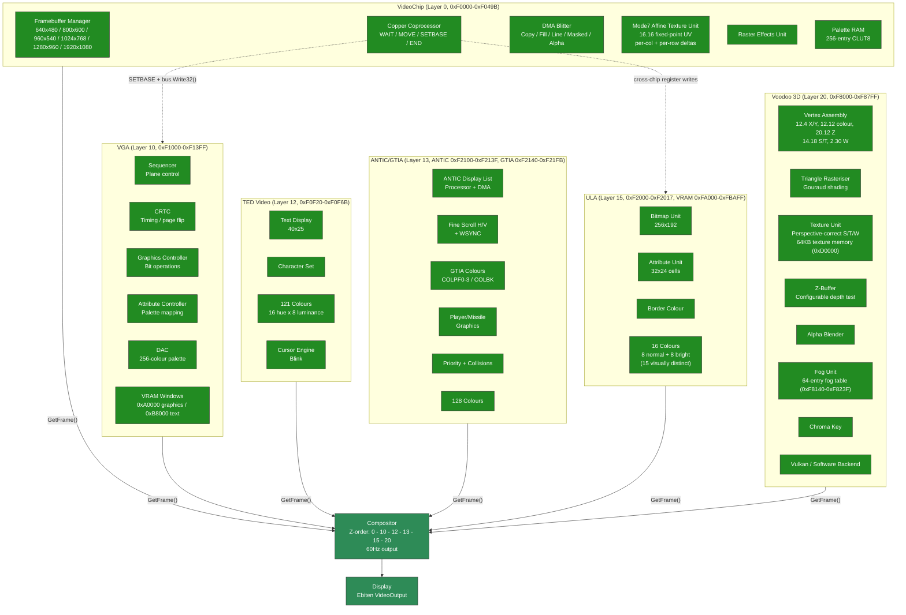
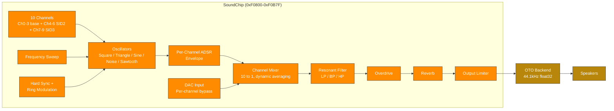
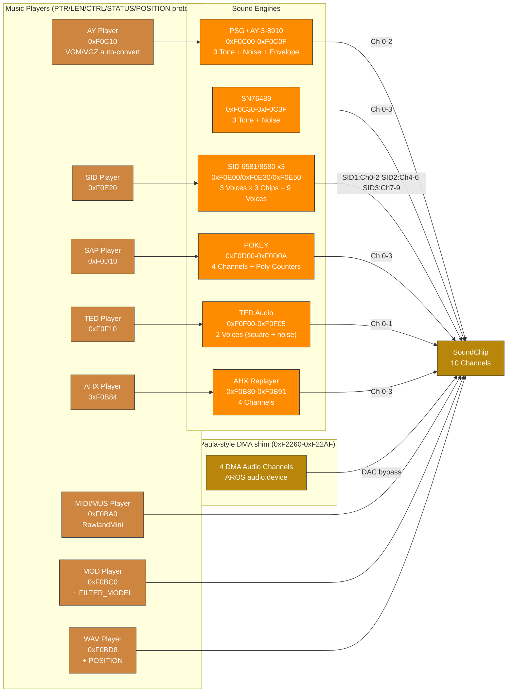
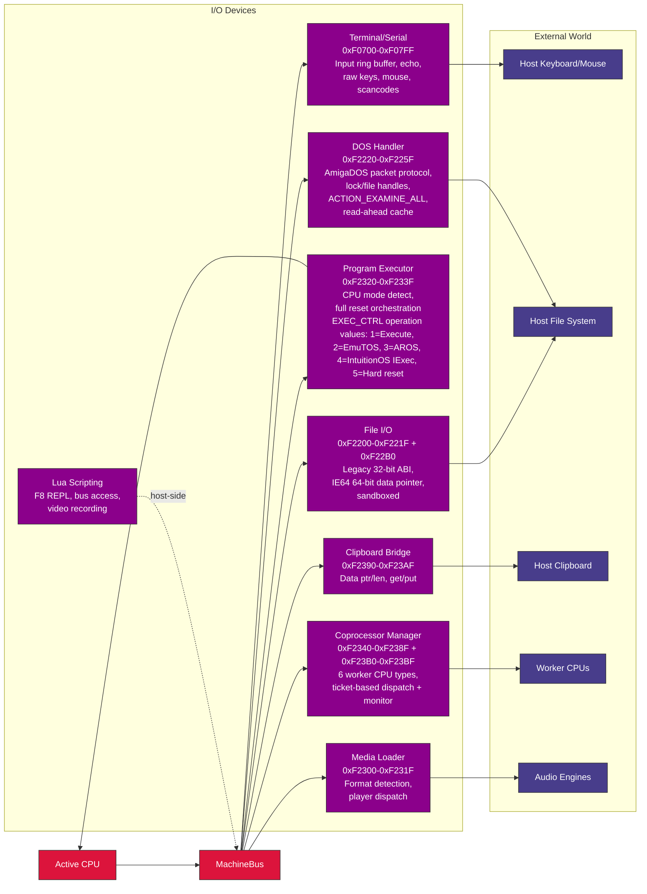
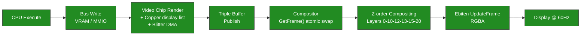
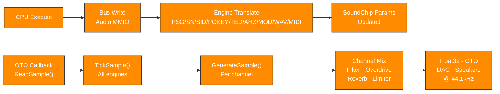

# Intuition Engine Architecture

*Last modified: 2026-06-13*

Intuition Engine is a multi-CPU fantasy computer with 6 heterogeneous CPU cores, 6 video systems, audio engines and players, a copper coprocessor, DMA blitter, and extensive I/O peripherals - all connected through a unified MachineBus. Total guest RAM is sized at boot from platform-dispatched usable-RAM detection (`/proc/meminfo` on Linux, `GlobalMemoryStatusEx` on Windows, and `hw.memsize` on Darwin) minus a per-platform reserve. Darwin RAM sizing uses a page-aligned conservative half of `hw.memsize` as the detected base before applying the per-platform reserve. Each CPU/profile sees an active visible RAM clamped to its own ceiling. Guest software discovers sizes through the SYSINFO MMIO pairs (`SYSINFO_TOTAL_RAM_LO/HI`, `SYSINFO_ACTIVE_RAM_LO/HI`) and IE64 `CR_RAM_SIZE_BYTES`. This document describes the system architecture with diagrams showing chips, buses, internal functional units, and data flow paths.

The diagrams below describe wired runtime behaviour. Platform availability
follows the runtime dispatch path; for example, the Z80 JIT is available
on amd64 builds only.

## Reading the Architecture Tables and Diagrams

Boxes represent runtime components. Arrows represent operational paths:
direct calls, bus mappings, shared-memory paths, queues, or host-service
dependencies. Memory-map rows describe guest-visible address ranges and
the device or subsystem that owns each range.

| Diagram/table item | Meaning |
|--------------------|---------|
| Address range | Guest-visible range plus decoded mapping, owner, and reservation/use semantics |
| Visible RAM size | RAM visible to the current CPU/profile, as reported by SYSINFO and CPU-specific discovery paths |
| CPU or JIT entry | CPU core or JIT backend available through the runtime dispatch path |
| Audio, video, or peripheral box | Engine, player, device, or bridge that participates in the running machine |
| Debugger or scripting path | Monitor, debug adapter, or Lua binding path used for inspection or automation |

If a feature is platform-limited, the table or diagram names the
supported platform path instead of implying that every implementation
file is active in every build.

## Single Complete Architecture Diagram

```mermaid
flowchart LR
    subgraph HOST["Host process and tooling"]
        MAIN["main.go<br/>CLI flags and boot profile"]
        SIZE["memory_sizing.go<br/>host-sized guest RAM"]
        PB["profile_bounds.go<br/>profile visible-RAM clamps"]
        DBG["Debug monitor<br/>breakpoints, watchpoints,<br/>CPU-local and whole-machine snapshots"]
        LUA["ScriptEngine<br/>Lua / IEScript"]
        SDK["SDK tools<br/>ie32asm, ie64asm, ie64dis,<br/>ie32to64, test generators"]
    end

    subgraph EXECUTION["Guest execution"]
        EXEC["ProgramExecutor<br/>EXEC MMIO and CPU switching"]
        COPROC["CoprocessorManager<br/>worker lifecycle and tickets"]
        IE32["IE32 interpreter"]
        IE64["IE64 interpreter"]
        M68K["M68K 68020 interpreter"]
        Z80["Z80 interpreter"]
        C6502["6502 interpreter"]
        X86["x86 interpreter / amd64 JIT path"]
        JIE64["IE64 JIT<br/>amd64 + arm64"]
        J6502["6502 JIT<br/>amd64"]
        JM68K["M68K JIT<br/>amd64"]
        JZ80["Z80 JIT<br/>amd64 only"]
        JX86["x86 JIT<br/>amd64 only"]
        CPUMON["Debug CPU adapters<br/>IE32, IE64, M68K, Z80, 6502, x86"]
    end

    subgraph BUSMEM["Shared address space"]
        BUS["MachineBus<br/>RAM, MapIO, MapIOByte,<br/>MapIO64, ioPageBitmap"]
        RAM["Guest RAM<br/>host-sized, profile-clamped"]
        SYSINFO["SYSINFO MMIO<br/>total/active RAM"]
        VGAMEM["VGA windows<br/>0xA0000 graphics<br/>0xB8000 text"]
        VRAM["Video RAM<br/>0x100000-0x5FFFFF"]
        ULAMEM["ULA VRAM aperture<br/>0xFA000-0xFBAFF"]
        VOOTEX["Voodoo texture memory<br/>0xD0000-0xDFFFF"]
        AROSMEM["AROS memory<br/>Fast RAM + video RAM"]
        COPMEM["Coprocessor memory slices<br/>IE32, IE64, M68K,<br/>Z80, 6502, x86"]
        MAILBOX["Coprocessor mailboxes<br/>0x790000-0x7917FF"]
        STAGING["Media staging buffer<br/>0x800000-0x80FFFF"]
    end

    subgraph OSLOAD["OS and loader shims"]
        EMUTOS["EmuTOS loader"]
        GEMDOS["GEMDOS intercept"]
        XBIOS["XBIOS intercept"]
        AROS["AROS loader"]
        ADOS["AROS DOS handler"]
        ADMA["AROS Paula-style audio DMA"]
        HOSTFS["Bootstrap HostFS"]
        FILEIO["File I/O MMIO"]
        MEDIA["Media loader"]
        CLIP["Clipboard bridge"]
        TERM["Terminal / serial / keyboard / mouse"]
        IRQD["IRQ diagnostic registers"]
    end

    subgraph VIDEO["Video systems"]
        VCHIP["VideoChip<br/>layer 0"]
        COPPER["Copper<br/>WAIT / MOVE / SETBASE / END<br/>bus-routed register writes"]
        BLITTER["DMA blitter<br/>copy, fill, line, alpha,<br/>colour expansion, scale, Mode7"]
        VCHPAL["VideoChip palette / CLUT8"]
        VGA["VGA<br/>layer 10"]
        VGASEQ["VGA sequencer"]
        VGACRTC["VGA CRTC"]
        VGAGC["VGA graphics controller"]
        VGADAC["VGA DAC"]
        TEDV["TED video<br/>layer 12"]
        ANTIC["ANTIC<br/>layer 13"]
        GTIA["GTIA<br/>colours, priority, collisions"]
        ULA["ULA<br/>layer 15"]
        VOO["Voodoo 3D<br/>layer 20"]
        VOORAST["Voodoo rasterizer<br/>triangles, texture, Z,<br/>alpha, fog, chroma key"]
        COMP["VideoCompositor<br/>layers 0/10/12/13/15/20"]
    end

    subgraph AUDIO["Audio systems"]
        SOUND["SoundChip<br/>10 flex channels + mixer"]
        SFX["SFX trigger channels"]
        PSG["PSG / AY-3-8910"]
        AYPLAYER["AY player"]
        SN["SN76489"]
        SID1["SID1"]
        SID2["SID2"]
        SID3["SID3"]
        SIDPLAYER["SID player"]
        POKEY["POKEY"]
        SAP["SAP player"]
        TEDA["TED audio"]
        TEDPLAYER["TED player"]
        AHX["AHX engine"]
        AHXPLAYER["AHX player"]
        MOD["MOD player"]
        WAV["WAV player"]
        MIDI["MIDI/MUS player"]
    end

    subgraph BACKENDS["Host backends"]
        EB["Ebiten video output"]
        HV["Headless video output"]
        OTO["OTO audio output"]
        HA["Headless audio output"]
        VULKAN["Voodoo Vulkan backend"]
        VSOFT["Voodoo software backend"]
    end

    MAIN --> SIZE --> BUS
    SIZE --> RAM
    PB --> RAM
    MAIN --> EXEC
    EXEC --> IE32
    EXEC --> IE64
    EXEC --> M68K
    EXEC --> Z80
    EXEC --> C6502
    EXEC --> X86
    EXEC --> COPROC
    COPROC --> IE32
    COPROC --> IE64
    COPROC --> M68K
    COPROC --> Z80
    COPROC --> C6502
    COPROC --> X86
    IE64 --> JIE64
    C6502 --> J6502
    M68K --> JM68K
    Z80 --> JZ80
    X86 --> JX86
    IE32 <--> BUS
    IE64 <--> BUS
    M68K <--> BUS
    Z80 <--> BUS
    C6502 <--> BUS
    X86 <--> BUS
    JIE64 <--> BUS
    J6502 <--> BUS
    JM68K <--> BUS
    JZ80 <--> BUS
    JX86 <--> BUS
    DBG --> CPUMON
    CPUMON --> IE32
    CPUMON --> IE64
    CPUMON --> M68K
    CPUMON --> Z80
    CPUMON --> C6502
    CPUMON --> X86
    LUA -.-> BUS

    BUS <--> RAM
    BUS <--> SYSINFO
    BUS <--> VGAMEM
    BUS <--> VRAM
    BUS <--> ULAMEM
    BUS <--> VOOTEX
    BUS <--> AROSMEM
    BUS <--> COPMEM
    BUS <--> MAILBOX
    BUS <--> STAGING

    BUS <--> EMUTOS
    EMUTOS --> GEMDOS
    EMUTOS --> XBIOS
    BUS <--> AROS
    AROS --> ADOS
    AROS --> ADMA
    BUS <--> HOSTFS
    BUS <--> FILEIO
    BUS <--> MEDIA
    BUS <--> CLIP
    BUS <--> TERM
    BUS <--> IRQD

    BUS <--> VCHIP
    VCHIP --> COPPER
    VCHIP --> BLITTER
    VCHIP --> VCHPAL
    BUS <--> VGA
    VGA --> VGASEQ
    VGA --> VGACRTC
    VGA --> VGAGC
    VGA --> VGADAC
    BUS <--> TEDV
    BUS <--> ANTIC
    ANTIC --> GTIA
    BUS <--> ULA
    BUS <--> VOO
    VOO --> VOORAST
    VCHIP --> COMP
    VGA --> COMP
    TEDV --> COMP
    ANTIC --> COMP
    ULA --> COMP
    VOO --> COMP

    BUS <--> SOUND
    SOUND --> SFX
    BUS <--> PSG
    AYPLAYER --> PSG
    BUS <--> SN
    BUS <--> SID1
    BUS <--> SID2
    BUS <--> SID3
    SIDPLAYER --> SID1
    SIDPLAYER --> SID2
    SIDPLAYER --> SID3
    BUS <--> POKEY
    SAP --> POKEY
    BUS <--> TEDA
    TEDPLAYER --> TEDA
    BUS <--> AHX
    AHXPLAYER --> AHX
    BUS <--> MOD
    BUS <--> WAV
    BUS <--> MIDI
    PSG --> SOUND
    SN --> SOUND
    SID1 --> SOUND
    SID2 --> SOUND
    SID3 --> SOUND
    POKEY --> SOUND
    TEDA --> SOUND
    AHX --> SOUND
    MOD --> SOUND
    WAV --> SOUND
    MIDI --> SOUND
    ADMA --> SOUND

    COMP --> EB
    COMP --> HV
    SOUND --> OTO
    SOUND --> HA
    VOO --> VULKAN
    VOO --> VSOFT
    SDK -.-> EXEC

    classDef host fill:#455A64,stroke:#263238,color:#fff
    classDef cpu fill:#1565C0,stroke:#0D47A1,color:#fff
    classDef bus fill:#B71C1C,stroke:#7F0000,color:#fff
    classDef os fill:#6A1B9A,stroke:#4A148C,color:#fff
    classDef video fill:#2E7D32,stroke:#1B5E20,color:#fff
    classDef audio fill:#EF6C00,stroke:#BF360C,color:#fff
    classDef backend fill:#37474F,stroke:#263238,color:#fff

    class MAIN,SIZE,PB,DBG,LUA,SDK host
    class EXEC,COPROC,IE32,IE64,M68K,Z80,C6502,X86,JIE64,J6502,JM68K,JZ80,JX86,CPUMON cpu
    class BUS,RAM,SYSINFO,VGAMEM,VRAM,ULAMEM,VOOTEX,AROSMEM,COPMEM,MAILBOX,STAGING bus
    class EMUTOS,GEMDOS,XBIOS,AROS,ADOS,ADMA,HOSTFS,FILEIO,MEDIA,CLIP,TERM,IRQD os
    class VCHIP,COPPER,BLITTER,VCHPAL,VGA,VGASEQ,VGACRTC,VGAGC,VGADAC,TEDV,ANTIC,GTIA,ULA,VOO,VOORAST,COMP video
    class SOUND,SFX,PSG,AYPLAYER,SN,SID1,SID2,SID3,SIDPLAYER,POKEY,SAP,TEDA,TEDPLAYER,AHX,AHXPLAYER,MOD,WAV,MIDI audio
    class EB,HV,OTO,HA,VULKAN,VSOFT backend
```



## 1. Whole-System Architecture


## 2. Layered System Overview



**Bus architecture notes:**

- **Concurrent multi-CPU bus** - the Program Executor selects the primary CPU mode, but the Coprocessor Manager can launch additional worker CPUs that run concurrently on the same bus. Address dispatch is immutable after mapping is sealed, `ioPageBitmap` provides the fast path, and I/O callbacks protect their own mutable state. There is no central bus-arbitration model exposed to guest software.
- **No centralised interrupt controller** - each CPU has per-CPU interrupt lines (IRQ/NMI as `atomic.Bool`). Peripherals signal the active CPU directly.
- **MMIO dispatch** - the bus uses an `ioPageBitmap []bool` fast path (page = 256 bytes). Non-I/O pages use direct unsafe pointer access with zero dispatch overhead.

### Runtime Data and Control Flow



### Subsystem Matrix

| Subsystem | Runtime surface | Primary files | Wired registration / dispatch |
|-----------|-----------------|---------------|-------------------------------|
| CPU cores | IE32, IE64, M68K, Z80, 6502, x86 | `cpu_*.go`, `cpu_*_runner.go` | `main.go` selects runners by file extension, OS mode, or EXEC MMIO |
| JIT | IE64 on amd64/arm64; 6502, M68K, Z80, x86 on amd64 | `jit_dispatch.go`, `jit_6502_dispatch.go`, `jit_m68k_dispatch.go`, `jit_z80_dispatch.go`, `jit_x86_dispatch.go` | Build tags plus `runtime.GOARCH`; non-supported hosts use dispatch stubs |
| Bus and RAM | Host-sized guest RAM, profile clamps, MMIO, byte/64-bit handlers | `machine_bus.go`, `memory_sizing.go`, `profile_bounds.go`, `sysinfo_mmio.go` | `main.go` registers devices before execution; `MachineBus.SealMappings` prevents late maps |
| Machine lifecycle | Load resolution, reset quiesce, CPU/profile recreation, monitor/runtime rewiring | `machine_lifecycle.go`, `main.go` | `main.go` owns concrete devices; `Machine` applies reset/load orchestration through injected dependencies and profile targets |
| Video | VideoChip, VGA, TED video, ANTIC/GTIA, ULA, Voodoo | `video_chip.go`, `video_vga.go`, `video_ted.go`, `video_antic.go`, `video_ula.go`, `video_voodoo.go` | `main.go` maps each register/VRAM block and registers compositor layers 0/10/12/13/15/20 |
| Audio | SoundChip/SFX, PSG/AY, SN76489, SID x3, TED, POKEY/SAP, AHX, MOD, WAV, MIDI/MUS | `audio_chip.go`, `sfx_trigger.go`, `psg_engine.go`, `sn76489_chip.go`, `sid_engine.go`, `ted_engine.go`, `pokey_engine.go`, `ahx_player.go`, `mod_player.go`, `wav_player.go`, `midi_player.go` | `main.go` maps chip/player MMIO and registers sample tickers/mixers into SoundChip; register-mapped players share `PlayerControlState` for staged playback requests |
| OS integration | EmuTOS, AROS, GEMDOS/XBIOS, AROS DOS, Paula-style DMA | `emutos_loader.go`, `aros_loader.go`, `gemdos_intercept.go`, `aros_dos_intercept.go`, `aros_audio_dma.go` | OS modes install intercept MMIO and loader state during boot/reset |
| Tooling | Assemblers, disassembler, transpiler, generators | `assembler/`, `internal/ie64meta/`, `cmd/gen_ie64_opmeta/`, `cmd/ie32to64/`, `cmd/gen_m68k_cputest/`, `cmd/gen_interp6502/` | Makefile builds SDK tools into `sdk/bin/`; IE64 opcode constants and name tables are generated from metadata |

### Internal Ownership Notes

- **IE64 opcode metadata** - `internal/ie64meta/table.go` is the source of
  truth for generated IE64 opcode constants and mnemonic/name tables used by
  the runtime CPU, monitor disassembler, standalone assembler, standalone
  disassembler, and internal assembler package. Build commands for `ie64asm`
  and `ie64dis` build `./assembler` with the relevant tag so generated files
  are compiled with the tagged tool entry point.
- **Machine lifecycle** - `Machine` in `machine_lifecycle.go` owns reset/load
  sequencing through dependency fields and profile targets. It preserves the
  existing guest-visible reset contract while keeping quiesce, failed-load
  rollback, CPU recreation, profile loading, and monitor/runtime rewiring out
  of the host event loop.
- **Audio playback control** - register-mapped music players use
  `PlayerControlState` for staged pointer/length registers, optional high
  pointer, bus reads, busy/error/loop state, subsong selection, and async
  generation invalidation. This covers SID, PSG/SN/SNDH, TED, POKEY/SAP, AHX,
  MOD, WAV, and MIDI/MUS without changing their public MMIO contracts.
- **Video scheduling** - `VideoScheduler` centralises ticker ownership for the
  compositor and migrated video render-loop shims. Tests can drive it manually;
  migrated engine files do not own `time.NewTicker` directly.
- **Voodoo software wrappers** - headless and `novulkan` builds share
  `softwareVoodooBackend` forwarding. The tagged Voodoo files keep feature
  registration and constructor selection only, so their `VoodooBackend` method
  sets stay identical.
- **IE64 MMU walk sharing** - CPU translation and bootstrap hostfs guest-pointer
  translation share the page-table walk result (`MMUSharedWalkResult`). CPU
  policy applies trap causes and A/D updates; hostfs policy requires `PTE_U` and
  leaves A/D bits untouched.

## Platform JIT Matrix

The host-side JIT support is intentionally asymmetric and follows the dispatch files, not emitter-file presence.
Release amd64 builds target x86-64-v3 (`GOAMD64=v3`, the Makefile default) for the
best Go-compiler codegen (AVX2, BMI1/2, FMA), but this is a recommendation, not a
hard requirement: the JIT only *requires* SSE4.1, which it emits unconditionally
for IE64 FINT (ROUNDSS). The amd64 backend detects this at runtime via CPUID; on a
host without SSE4.1 `initJIT` (via `checkJITHostFeatures`) declines to enable the JIT
and the CPU falls back to the interpreter rather than aborting, so plain `go run .` /
`go build` at the default `GOAMD64=v1` works on any x86-64 CPU (older hosts simply run
interpreted). AVX2/BMI2/LZCNT paths are separately runtime-gated via `x86Host` and are
never emitted unless the host supports them.

| Host platform | JIT-enabled guest cores | Dispatch files |
|---------------|-------------------------|----------------|
| Linux amd64 | IE64, 6502, M68K, Z80, x86 | `jit_dispatch.go`, amd64 per-core dispatch files |
| Linux arm64 | IE64 | `jit_dispatch.go`; Z80 dispatch compiles but keeps `z80JitAvailable` false |
| Windows amd64 | IE64, 6502, M68K, Z80, x86 | amd64 per-core dispatch files |
| Windows arm64 | IE64 | IE64 dispatch only; per-core non-IE64 stubs |
| macOS amd64 | IE64, 6502, M68K, Z80, x86 | amd64 per-core dispatch files |
| macOS arm64 | IE64 | IE64 dispatch plus Darwin arm64 JIT write-protect helpers |

On macOS amd64, the JIT reuses the shared x86-64 host backends. On macOS arm64, executable memory uses the native `MAP_JIT` model with thread-pinned write protection toggles, and non-IE64 guest cores remain interpreter-only on arm64 hosts.

### IE64 JIT 64-bit Execution Model

The IE64 JIT (amd64 and arm64) executes code, accesses data, and operates the
stack at any `uint64` virtual or physical address, matching the interpreter.
There is no `uint32` truncation on the PC, data addresses, stack pointer,
branch targets, or chain targets. The one stack exception is the amd64 non-MMU
fused-leaf path (documented below): it raw-indexes `[MemBase+SP]` and so assumes
the SP is in the low window.

`SEI64` and `CLI64` are emitted as per-instruction interpreter bails (not NOPs) so
they mutate `interruptEnabled` under the JIT. External device interrupts are
delivered through a record-only sink and a pending mask polled at instruction and
block boundaries by both the interpreter and the JIT dispatcher; see the "External
Interrupt Delivery" section of this manual for the full model.

- **Low memory window**: each guest sees a contiguous low RAM window backed by
  the dense `cpu.memory[]` slice, capped at 256 MiB for the IE64 family
  (`lowMemWindowBytes`). The actual `len(bus.memory)` is
  `min(autodetected TotalGuestRAM, busMemCap)` (main.go), so on a small host the
  window can be smaller than the cap. Addresses above the window resolve through
  the bus's 64-bit physical path, backed by the `Backing` interface -- production
  IE64 boots on Linux/darwin bind high RAM via `MmapBacking`; `SparseBacking` is
  the test implementation. High physical addresses are supported for code fetch
  and for data / stack *operands* (the latter via the helper exit, including a
  high SP), with one caveat below.
- **High-PC stack-op caveat**: a block *fetched from* high physical backing
  that itself contains a stack op (`PUSH`/`POP`/`JSR`/`RTS`/`JSR_IND`) is not
  JIT-compiled -- `ExecuteJIT` takes the `highPhys && containsStackOp(instrs)`
  path and runs the block one instruction at a time through `interpretOne()`
  (which routes the stack through the bus). This is pinned by
  `TestJIT_HighPC_StackOpBlock_BailsToInterpreter`. Stack ops in blocks fetched
  from the low window are JIT-compiled and, for a high SP, route through the
  helper exit -- **except** the fused-leaf path below.
- **Fused-leaf high-SP exception**: on amd64 with the MMU off,
  `scanBlock` may fuse a `JSR64` to a small leaf subroutine
  (`ie64FusedJSRLeafCall` / `ie64FusedRTSLeafReturn`, gated by
  `ie64ScanJSRLeafFusionEnabled` -- amd64 only). The fused emit
  (`jit_emit_amd64.go`) handles the call/return push/pop as **raw**
  `[MemBase+SP]` traffic *before* the normal `emitJSR_AMD64`/`emitRTS_AMD64`
  high-SP guards, so it does **not** take the helper exit. This is safe only
  because the marker is suppressed whenever `mmuBail` is set, but `mmuBail` for
  fused leaves is set by `compileBlockMMU` (MMU mode) only -- in non-MMU mode a
  fused leaf with an SP outside the low window would read/write past
  `cpu.memory[]`. Non-MMU guests are therefore expected to keep the stack in
  the low window; high-SP correctness via the helper exit holds for unfused
  stack ops, not for fused leaves.
- **Direct fast path vs. helper exit**: native code uses a direct
  `[memBase+addr]` access only when the MMU is off **and** the address is in the
  low window (size-aware bound: `addr <= MemSize - accessBytes`). Otherwise it
  takes the JITContext-mediated *helper exit*.
- **Helper exit protocol**: native code cannot safely call back into Go (it runs
  on g0 via `asmcgocall`), so on a high/MMU access it writes a structured request
  to the `JITContext` (`NeedHelper`, `HelperAddr`, `HelperSize`, `HelperVal`,
  `HelperRd`, `HelperPC`, `LiveSP`), flushes the live SP and the faulting
  instruction's PC, and returns through the epilogue. `ExecuteJIT` dispatches the
  request (`handleJITHelper`) and re-enters the JIT. Helper ops cover
  `LOAD`/`STORE`, `FLOAD`/`FSTORE`, `DLOAD`/`DSTORE`, `PUSH`/`POP`, and the
  control-flow `JSR`/`RTS`/`JSR_IND`.
- **Interpreter parity**: helpers use `cpu.loadMem`/`storeMem` for data and
  `cpu.mmuStackWrite`/`mmuStackRead` for the stack -- the same paths as the
  interpreter. JSR sets PC to the call target, RTS sets PC to the popped return
  address, and JSR_IND sets PC to `rs + sext(imm32)` -- the displacement is
  sign-extended, so a negative `imm32` (bit 31 set) subtracts (with `rs == R31`
  based on the decremented SP). The FP load/store side effects differ: FLOAD and
  DLOAD set the destination FP register **and** the FP condition codes; FSTORE
  and DSTORE read the FP register and write memory, leaving FP registers and
  condition codes unchanged -- matching the interpreter in each case.
- **MMU rule**: when the MMU is enabled, non-atomic data/stack ops take the
  helper exit (virtual-to-physical mapping is not a direct offset). The
  dispatcher refreshes `ctx.MMUEnabled` before every `callNative` so the native
  guards are never stale.
- **Fault contract**: the handler sets `cpu.PC = HelperPC` before the operation,
  so `trapFault` records the correct `faultPC`; faulting instructions are not
  counted and re-execute after the trap. Pre-decrement ops (PUSH/JSR/JSR_IND)
  roll the SP back on a trapping fault.
- **Atomics carve-out**: atomics (CAS/XCHG/FAA/FAND/FOR/FXOR) do not use the
  helper-exit protocol. The native emitters run sequentially-consistent
  host-atomic fast paths only for aligned, non-MMU, low-window RAM addresses;
  MMU-on, high-address, MMIO, or unaligned cases bail to the interpreter so the
  canonical `atomicRMW64` trap and bus semantics apply. `compileBlockMMU` also
  sets `mmuBail` on fused JSR/RTS leaf markers, so under MMU the `OP_JSR64`/
  `OP_RTS64` emit takes the `mmuBail` branch to `emitBailToInterpreter` (a
  whole-instruction interpreter bail with its own fault/accounting path) --
  neither the raw fused fast path nor the guarded helper exit runs. In non-MMU
  mode `mmuBail` is unset, so the raw fused fast path is used (see the
  fused-leaf high-SP exception above).

## Build Profiles and Observable Runtime

Build tags change host backends, not the guest-visible ISA contract. The main
guest bus, CPU cores, MMIO register addresses, assemblers, and script binding
names remain the reference surface unless a specific backend is absent from the
build. On amd64, release profiles target x86-64-v3 for codegen quality; lower
`GOAMD64` levels still build and run, with SSE4.1 as the enforced runtime floor.

| Profile | Build tags / knobs | Runtime effect visible to users |
|---------|--------------------|---------------------------------|
| Default VM | no special tag | Ebiten display, Oto audio, Vulkan-backed Voodoo where available, and normal host integrations. |
| `novulkan` | `-tags novulkan` | Voodoo uses the software backend and does not require the Vulkan SDK. Guest Voodoo registers remain mapped. |
| `headless` | `-tags headless` | Display, audio backend, overlay, clipboard, and GUI integrations use stubs suitable for CI. CPU, bus, MMIO, scripting, and most device state paths still compile for tests. |
| `headless-novulkan` | `CGO_ENABLED=0 -tags "novulkan headless"` | Pure-Go portable VM build with headless stubs and software Voodoo path. |

Headless stubs should be treated as backend substitutes, not as a different
machine model. A test can still write video or audio MMIO and inspect guest
state, but there is no host window, host audio device, or GUI overlay to observe
the result directly.

## 3. CPU Subsystem



### CPU Timers (IE32 / IE64)

Both IE32 and IE64 use CPU-internal countdown timers backed by atomic fields on the CPU structs.

- IE32 increments an internal cycle counter once per decoded instruction step,
  after fetch and operand resolution and before the decoded instruction body
  executes; when that counter reaches `SAMPLE_RATE`, it resets the counter and
  decrements the timer count by one.
- IE64 decrements the timer count once per decoded instruction step, after
  fetch/decode and before the decoded instruction body executes. When the IE64
  timer is armed, JIT dispatch uses the CPU single-instruction path so an
  interrupt can be delivered before the body of the instruction whose decoded
  step expires the timer.
- On expiry, it sets timer state to expired and can trigger a CPU interrupt.
- If still enabled after interrupt handling, the count auto-reloads from the configured period.

There is no stable bus/MMIO timer control ABI at present. Legacy include symbols such as `TIMER_CTRL/TIMER_COUNT/TIMER_RELOAD` are retained for compatibility but are deprecated.

### CPU Selection by File Extension

| Extension | CPU | Address Space | Notes |
|-----------|-----|---------------|-------|
| `.iex` / `.ie32` | IE32 | 32-bit flat (clamped to active visible RAM) | Native RISC, 8-byte fixed instructions |
| `.ie64` | IE64 | 64-bit (sees full active visible RAM) | 64-bit RISC, R0=zero, JIT on ARM64 + x86-64 |
| `.ie68` | M68K | 32-bit flat (clamped to active visible RAM) | Bare 68020, big-endian with LE bus adapter |
| `.ie65` | 6502 | 16-bit + bank windows | Bank windows reach the banked-CPU visible ceiling |
| `.ie80` | Z80 | 16-bit + bank windows + port I/O bridge | Bank windows reach the banked-CPU visible ceiling |
| `.ie86` | x86 | 32-bit flat (clamped to active visible RAM) + compatibility bank windows | Ordinary addressing is flat; bank/VRAM windows are compatibility overlays |
| `.tos` / `.img` | M68K | EmuTOS profile (`EmuTOS_PROFILE_TOP`) | EmuTOS boot with GEMDOS intercept |
| `.ies` | Script | N/A | Lua scripting engine (IE Script) |

Bare `.ie68` uses the active-visible RAM ceiling; EmuTOS and AROS M68K loader modes use profile bounds.

AROS boot is selected by CLI mode (`-aros`, optional `-aros-image`), not file extension.

### Z80 Port I/O Bridge

Z80 `IN`/`OUT` instructions are translated to bus MMIO accesses by the `Z80BusAdapter`:

| Z80 Port | Chip | Bus Target | Protocol |
|----------|------|------------|----------|
| `$A0-$AD` | VGA | `0xF1000` | Direct register map (MODE, STATUS, CTRL, SEQ, CRTC, GC, DAC, DAC read index, DAC mask, VRAM bank) |
| `$B0-$B7` | Voodoo 3D | `0xF8000` | Addr lo/hi + 4 data bytes (write to `$B5` triggers 32-bit bus write) |
| `$D0/$D1` | POKEY | `0xF0D00` | Register select / data |
| `$D4/$D5` | ANTIC | `0xF2100` | Register select / data (x4 stride) |
| `$D6/$D7` | GTIA | `0xF2140` | Register select / data (x4 stride, collision regs through `0xF21F8`) |
| `$E0/$E1` | SID | `0xF0E00/0xF0E30/0xF0E50` | Register select / data; select bits 5-6 choose SID1/SID2/SID3 |
| `$E4/$E5` | SN76489 | `0xF0C30/0xF0C31` | Data write / last-written read and ready-status read |
| `$F0/$F1` | PSG | `0xF0C00` | Register select / data |
| `$F2/$F3` | TED | `0xF0F00` / `0xF0F20-0xF0F6B` | Register select / data (audio indices `$00-$05`, video indices `$20-$32` x4 stride) |
| `$FE/$FD/$BE/$FA/$FB/$FC` | ULA | `0xF2000-0xF2014` | Border, control, status, VRAM address latch low/high, and paged VRAM data |

### Z80 16-bit Memory Translation

Z80 memory accesses in `0xF000-0xFFFF` are translated to bus `0xF0000-0xF0FFF`. ANTIC/GTIA access is provided through the Z80 port bridge (`$D4-$D7`) rather than general memory-mapped addressing.

### x86 Port I/O Bridge

x86 shares the Z80 Voodoo port mapping (`$B0-$B7`) and most sound-chip port mappings, but **POKEY uses direct port-to-register mapping** (not the Z80's select/data protocol). x86 does not implement standard PC VGA I/O ports; VGA access is through the shared bus MMIO aperture and the direct `$A0000-$AFFFF` VRAM memory window.

| x86 Port | Chip | Bus Target | Protocol |
|----------|------|------------|----------|
| `$B0-$B7` | Voodoo 3D | `0xF8000` | Addr lo/hi + 4 data bytes |
| `$60-$69` | POKEY | `0xF0D00+(port-0x60)` | **Direct** - port offset maps to writable register |
| `$D4/$D5` | ANTIC | `0xF2100` | Register select / data (x4 stride) |
| `$D6/$D7` | GTIA | `0xF2140` | Register select / data (x4 stride, collision regs through `0xF21F8`) |
| `$E0/$E1` | SID | `0xF0E00/0xF0E30/0xF0E50` | Register select / data; select bits 5-6 choose SID1/SID2/SID3 |
| `$F0/$F1` | PSG | `0xF0C00` | Register select / data |
| `$F2/$F3` | TED | `0xF0F00` / `0xF0F20-0xF0F6B` | Register select / data (audio indices `$00-$05`, video indices `$20-$32` x4 stride) |
| `$FE` | ULA | `0xF2000` | Border colour only (bits 0-2) |

**Key difference from Z80**: x86 POKEY access is direct - ports `$60-$69` map one-to-one onto writable POKEY registers at `0xF0D00+(port-0x60)`. ANTIC (`$D4/$D5`) and GTIA (`$D6/$D7`) keep their own select/data pairs.

x86 also directly accesses VGA VRAM at `$A0000-$AFFFF` in the memory path (no port translation needed).

### Bank Windows (Z80 / 6502 / x86)

The banked 6502/Z80 ABI uses bank windows to access a 32 MiB banked-CPU visible ceiling from a 16-bit address space; bank translation rejects addresses at or above that ceiling. x86 ordinary addressing remains flat 32-bit, but the x86 bus adapter also implements the same compatibility bank windows plus a VRAM bank window. Those x86 window translations are capped at the legacy `DEFAULT_MEMORY_SIZE` ceiling; ordinary x86 addressing remains clamped by the active visible RAM exposed through the shared bus.

| CPU Address | Size | Purpose | Bank Select Register |
|-------------|------|---------|---------------------|
| `$2000-$3FFF` | 8KB | Bank 1 (sprite data) | `$F700/$F701` (lo/hi) |
| `$4000-$5FFF` | 8KB | Bank 2 (font data) | `$F702/$F703` (lo/hi) |
| `$6000-$7FFF` | 8KB | Bank 3 (general) | `$F704/$F705` (lo/hi) |
| `$8000-$BFFF` | 16KB | VRAM window | `$F7F0` (bank number) |
| `$F000-$FFF9` | 4090B | I/O window, excluding 6502 vectors | Hardwired: `$Fxxx` -> bus `$F0xxx` |
| `$F200-$F24F` | 80B | Coprocessor gateway subrange | Hardwired: -> bus `$F2340+offset` |
| `$FFFA-$FFFF` | 6B | 6502 vectors (NMI/RESET/IRQ) | Identity mapped |

### 6502 I/O Chip Page Dispatch

The 6502 uses `ioTable[page]` to route memory-mapped I/O through the bus:

| 6502 Address | Chip | Bus Target | Notes |
|--------------|------|------------|-------|
| `$D200-$D209` | POKEY | `0xF0D00+offset` | |
| `$D400-$D40F` | PSG | `0xF0C00+offset` | |
| `$D500-$D51F` | SID1 | `0xF0E00+offset` | 32-byte window |
| `$D520-$D53F` | SID2 | `0xF0E30+offset` | 32-byte window |
| `$D540-$D55F` | SID3 | `0xF0E50+offset` | 32-byte window |
| `$D600-$D605` | TED Audio | `0xF0F00+offset` | |
| `$D620-$D632` | TED Video | `0xF0F20+offset x4` | Stride-4 register mapping including raster compare registers |
| `$D700-$D70D` | VGA | `0xF1000` | Direct handler call plus DAC read index, DAC mask, and VRAM bank |
| `$D800-$D817` | ULA | `0xF2000+offset` | Registers plus paged VRAM data port |

ANTIC/GTIA intentionally has no 6502 `$D400/$D000` compatibility surface; `$D400-$D40F` is PSG on the 6502 map.

## 4. Video Subsystem



### Copper Cross-Chip Bus Access

The copper coprocessor is internal to VideoChip but can write to any MMIO-mapped chip on the bus:

- **Default**: MOVE targets VideoChip's own registers (`copperIOBase = VIDEO_REG_BASE`)
- **SETBASE opcode** changes `copperIOBase` to any MMIO address (e.g. `VGA_BASE 0xF1000`)
- Subsequent MOVE instructions compute `regAddr = copperIOBase + (regIndex * 4)` and route via `bus.Write32()` to VGA, ULA, or any other chip's MMIO
- This enables per-scanline palette changes, mode switches, and register manipulation on any video chip
- `copperIOBase` resets to `VIDEO_REG_BASE` at the start of each frame
- The compositor's `ScanlineAware` interface orchestrates this: `StartFrame()` -> `ProcessScanline(y)` -> `FinishFrame()`

### Extended Blitter: BPP Modes, Draw Modes, Colour Expansion, and Scale

The blitter supports two pixel formats via `BLT_FLAGS` (`0xF0488`): RGBA32 (4 bpp, default) and CLUT8 (1 bpp). Bits 4-7 select one of 16 raster draw modes (Clear, And, Copy, Xor, Invert, etc.) applied per pixel during FILL and COPY operations. `BLT_OP=4` performs source-over alpha blending with source alpha in bits 31-24 using `out = (src*a + dst*(255-a))/255`. With `BLT_FLAGS` bit 12 (`ALPHA_TMPL`) set, `BLT_OP=4` instead treats `BLT_SRC` as an 8 bpp alpha plane (row stride in `BLT_SRC_STRIDE`) and blends the `BLT_FG` colour over the destination with the same source-over equation. This serves antialiased glyph and icon rendering (the AROS driver uses it for `PutAlphaTemplate`). `BLT_OP=7` performs nearest-neighbour scaling in RGBA32 or CLUT8. When `BLT_FLAGS=0`, the blitter defaults to Copy mode with RGBA32 for full backward compatibility.

Masked copies (`BLT_OP=3`) copy source pixels only where a 1-bit mask is set. The mask base address is in `BLT_MASK`, the mask row stride in `BLT_MASK_MOD` (0 selects packed rows of `(width+7)/8` bytes), and `BLT_MASK_SRCX` gives the starting bit offset within each mask row. Mask bits are sampled LSB-first by default; setting `BLT_FLAGS` bit 11 (`MASK_MSB`) selects MSB-first sampling, which matches the Amiga PLANEPTR convention used by AROS layer masks, so the driver can pass `CopyBoxMasked` masks to the hardware without conversion.

`BLT_CTRL` bit 0 starts the synchronous blit, bit 1 is read-only busy, and bit 2 enables a completion pulse on `IntMaskBlitter`. `BLT_STATUS` bit 0 is ERR, bit 1 is DONE, and bit 2 is sticky IRQ_PENDING (write 1 to clear). Invalid opcodes, out-of-range Mode7 samples, overflowed blitter bounds, and destination rectangles outside CPU-visible writable memory set ERR and do not silently fall back to COPY or wrap into another address range.

The colour expansion operation (`BLT_OP=6`) renders 1-bit glyph templates into coloured pixels for hardware-accelerated text. It reads a template from `BLT_MASK`, uses `BLT_FG`/`BLT_BG` (`0xF048C`/`0xF0490`) as foreground/background colours, and supports three modes: JAM2 (opaque - set bits write FG, clear bits write BG), JAM1 (transparent - only set bits write FG), and Invert (set bits XOR the destination). `BLT_MASK_MOD` (`0xF0494`) sets the template row stride and `BLT_MASK_SRCX` (`0xF0498`) provides sub-byte bit alignment for glyph fragments. Template bits are MSB-first (Amiga convention).

Line drawing (`BLT_OP=2`) supports an extended mode when `BLT_FLAGS != 0`: `BLT_DST` becomes the framebuffer base address, `BLT_WIDTH` holds the packed endpoint coordinates `(y1<<16)|x1`, and `BLT_DST_STRIDE` sets the row stride. This allows line drawing into arbitrary bitmaps (not just the active framebuffer) with BPP awareness and all 16 draw modes. When `BLT_FLAGS=0`, legacy behaviour is preserved (endpoint in `BLT_DST`, base at `VRAM_START`). In extended mode the blitter does not clip - callers must provide pre-clipped coordinates (the AROS driver uses Cohen-Sutherland clipping before calling the blitter).

Scale blits (`BLT_OP=7`) use `BLT_SRC`/`BLT_DST` as base addresses, `BLT_WIDTH`/`BLT_HEIGHT` as the source size in pixels, and `BLT_COLOR` as a packed destination size (`height << 16 | width`). `BLT_SRC_STRIDE` defaults to source width times bytes-per-pixel. `BLT_DST_STRIDE` defaults to the active VideoChip mode stride for VRAM destinations or destination width times bytes-per-pixel for ordinary memory. In non-direct VRAM mode, visible VRAM accesses use the active VideoChip front buffer and off-screen VRAM aperture accesses fall back to bus memory so back buffers can be presented through `VIDEO_FB_BASE`. Out-of-bounds source or destination rectangles, rectangles crossing the VRAM aperture end, zero source dimensions, and zero destination dimensions set `BLT_STATUS.ERR`.

Raster-band register draws (`VIDEO_RASTER_Y`, `VIDEO_RASTER_HEIGHT`, `VIDEO_RASTER_COLOR`, `VIDEO_RASTER_CTRL`) target the active framebuffer source. In RGBA32 mode, a nonzero `VIDEO_FB_BASE` writes the band into bus memory at that base; otherwise it writes the internal front buffer or direct VRAM slice. In CLUT8 mode, raster bands write indexed bytes at `VIDEO_FB_BASE`.

| Register | Address | Description |
|----------|---------|-------------|
| `BLT_FLAGS` | `0xF0488` | BPP (bits 0-1), draw mode (bits 4-7), JAM1/invert flags (bits 8-10), MSB-first mask sampling (bit 11), alpha-template blend (bit 12) |
| `BLT_FG` | `0xF048C` | Foreground colour for colour expansion |
| `BLT_BG` | `0xF0490` | Background colour for colour expansion |
| `BLT_MASK_MOD` | `0xF0494` | Template row modulo (bytes per row) |
| `BLT_MASK_SRCX` | `0xF0498` | Starting X bit offset in template |

### Mode7 Affine Texture Unit

The blitter's Mode7 operation (`bltOpMode7`) implements SNES-style affine texture mapping as a DMA blitter mode within VideoChip. It uses 8 dedicated MMIO registers (`0xF0058-0xF0074`):

| Register | Address | Description |
|----------|---------|-------------|
| `BLT_MODE7_U0` | `0xF0058` | Starting U coordinate (16.16 fixed-point) |
| `BLT_MODE7_V0` | `0xF005C` | Starting V coordinate (16.16 fixed-point) |
| `BLT_MODE7_DU_COL` | `0xF0060` | U increment per column (16.16) |
| `BLT_MODE7_DV_COL` | `0xF0064` | V increment per column (16.16) |
| `BLT_MODE7_DU_ROW` | `0xF0068` | U increment per row (16.16) |
| `BLT_MODE7_DV_ROW` | `0xF006C` | V increment per row (16.16) |
| `BLT_MODE7_TEX_W` | `0xF0070` | Texture width mask (must be power-of-2 minus 1) |
| `BLT_MODE7_TEX_H` | `0xF0074` | Texture height mask (must be power-of-2 minus 1) |

The rasteriser walks each destination pixel, computes the source UV from the affine matrix (origin + column delta + row delta), wraps via power-of-2 bitmask, and samples the source texture. This enables rotation, scaling, and perspective-like effects on tiled backgrounds - the same technique used by the SNES PPU2 for its Mode 7 background layer.

VideoChip Mode7 honours the `BLT_FLAGS` BPP field: RGBA32 samples and writes 4-byte pixels, while CLUT8 samples and writes 1-byte palette indices with BPP-aware default strides. In RGBA32 mode the default source stride is `(texture mask width + 1) * 4`; in CLUT8 mode the default source stride is `(texture mask width + 1)`. The destination stride follows the same BPP-aware default-stride rules as the other blitter operations: active framebuffer width in bytes for VRAM destinations, or destination width times bytes-per-pixel for ordinary memory.

### Video Compositor

The compositor collects immutable frame snapshots from all enabled video sources and blends them in Z-order (layer 0 at the back, layer 20 at the front). For IEVideoChip CLUT8 mode, both mapped VRAM and direct bus-backed VRAM are converted through the palette before compositing. Desktop startup uses a 1920x1080 fullscreen presentation by default, and the x64 live-image launcher locks it fullscreen through `IE_LIVE_IMAGE=1`. Native sources keep their requested dimensions. The default native mode is 960x540 for exact 2x 1080p presentation. Video compositor default scale mode is stretch-fill; F11 toggles non-16:9 sources to aspect-fit. `Shift+F11` toggles fullscreen/windowed mode when that mode is not locked.

Two rendering paths:

1. **Scanline-aware path** - used when at least one enabled source implements `ScanlineAware`. The compositor advances scanline-capable sources in sorted layer order for each scanline, then blends all enabled sources in the global layer order. Opaque full-frame sources can sit below, between, or above scanline-aware sources without breaking copper/VGA per-scanline effects.
2. **Full-frame fallback** - used when no enabled source is scanline-aware. It collects complete frames and blends them in sorted layer order. Same-size frame blending uses parallel goroutines with 60-line strips via `sync.WaitGroup`.

All-zero frame pixels are transparent; any nonzero alpha or RGB value is opaque. During compositing, zero-alpha nonzero-RGB pixels are promoted to opaque `0xFFRRGGBB` before they overwrite the destination. The compositor tick remains fixed at 60 Hz for guest VBlank compatibility; `GetRefreshRate()` reports the output backend rate, while `GetTickRate()` reports the compositor tick.

### Triple-Buffer Protocol

All video systems except VideoChip use a lock-free triple-buffer protocol for `GetFrame()`:

```text
Slots:  writeIdx = 0 (producer-owned)
        sharedIdx = 1 (atomic, in-transit)
        readingIdx = 2 (consumer-owned)

Producer (render goroutine, after rendering into frameBufs[writeIdx]):
    writeIdx = sharedIdx.Swap(writeIdx)

Consumer (compositor, GetFrame):
    readIdx = sharedIdx.Swap(readIdx)
    return frameBufs[readIdx]
```

**Important**: `GetFrame()` performs an atomic Swap - calling it twice in a row swaps back to the previous buffer. Always call once and save the result.

On resolution change, all 3 buffer slots are reallocated and indices reset to `writeIdx=0`, `sharedIdx=1`, `readingIdx=2`.

## 5. Audio Subsystem

### Synthesis Pipeline



### SoundChip Dual-Interface Architecture

The SoundChip exposes two register interfaces for its channels:

**Legacy per-waveform interface** (`0xF0900-0xF09FF`) - dedicated register blocks with two decoded sweep-register exceptions:

Decoded ranges: `0xF0900-0xF093F except 0xF0914 and 0xF0918`, `0xF0940-0xF097F plus 0xF0914`, and `0xF0980-0xF09BF plus 0xF0918`.

| Range | Channel | Default Waveform |
|-------|---------|-----------------|
| `0xF0900-0xF093F` | Ch 0 | Square, except `0xF0914` is triangle sweep and `0xF0918` is sine sweep |
| `0xF0940-0xF097F` plus `0xF0914` | Ch 1 | Triangle |
| `0xF0980-0xF09BF` plus `0xF0918` | Ch 2 | Sine |
| `0xF09C0-0xF09FF` | Ch 3 | Noise |
| `0xF0A00-0xF0A6F` | - | Sawtooth + modulation/effects |

Within the modulation/effects window, `0xF0A00-0xF0A1C` holds the sync-source and ring-modulation-source registers, `0xF0A20-0xF0A6F` holds the sawtooth legacy registers, and `0xF0A40`, `0xF0A50`, and `0xF0A54` hold overdrive and reverb controls.

**FLEX unified interface** (`0xF0A80-0xF0B7F`) - 4 channels with identical 64-byte register blocks. Each channel can be any waveform type:

| Offset | Register | Description |
|--------|----------|-------------|
| `+0x00` | `FREQ` | 16.8 fixed-point Hz (value / 256.0) |
| `+0x04` | `VOL` | Volume (0-255) |
| `+0x08` | `CTRL` | Enable (bit 0), gate (bit 1) |
| `+0x0C` | `DUTY` | Pulse width duty cycle; high byte is PWM depth scaled by 1/256 |
| `+0x10` | `SWEEP` | Frequency sweep rate |
| `+0x14-0x20` | `ATK/DEC/SUS/REL` | ADSR envelope |
| `+0x24` | `WAVE_TYPE` | Waveform selection |
| `+0x28` | `PWM_CTRL` | Pulse width modulation |
| `+0x2C` | `NOISEMODE` | Noise mode (0=white, 1=periodic, 2=metallic, 3=psg) |
| `+0x30` | `PHASE` | Phase reset |
| `+0x34` | `RINGMOD` | Ring modulation (bit 7=enable, 0-2=source) |
| `+0x38` | `SYNC` | Hard sync (bit 7=enable, 0-2=source) |
| `+0x3C` | `DAC` | DAC mode bypass (signed 8-bit sample, -128=-1.0, +127=+1.0) |

FLEX channels are at `FLEX_CH0_BASE = 0xF0A80`, stride = `0x40`. Primary channels 0-3 occupy `0xF0A80-0xF0B7F`; SID2 flex channels 4-6 occupy `0xF0C40-0xF0CFF`; SID3 flex channels 7-9 occupy `0xF0D40-0xF0DFF`. `AUDIO_CTRL` uses bit 0 for enable and bit 1 for freeze. `ENV_SHAPE` remains at `0xF0804` for channel 0, with per-channel shapes at `0xF0860 + channel*4`. Both legacy and FLEX interfaces write to the same underlying 10-channel mixer. The FLEX interface is preferred for new code - the legacy interface exists for backward compatibility.

### Filter and Modulation

The SoundChip's global resonant filter (`0xF0820-0xF0830`) supports low-pass, band-pass, and high-pass modes with cutoff frequency, resonance, and optional filter modulation source/amount registers. Cutoff and resonance smooth toward register targets at the same 0.02 coefficient used by per-channel filters. SID 12-bit DAC quantization truncates to remove half-LSB DC bias.

### Engine and Player Routing



### Audio Engine Plus Enhanced Mode

All five classic-style sound engines have a "Plus" enhanced mode, activated by writing `1` to their respective `PLUS_CTRL` register:

| Engine | PLUS_CTRL Address | Enhancements |
|--------|-------------------|--------------|
| PSG+ | `0xF0C20` | Enhanced render path: oversampling, filtering, drive/room shaping, stereo voicing |
| SID+ | `0xF0E19` | Enhanced render path for SID voices (oversampling/filter/drive/room shaping) |
| POKEY+ | `0xF0D09` | Enhanced render path (oversampling/filter/drive/room shaping) |
| TED+ | `0xF0F05` | Enhanced render path plus TED-specific response shaping |
| AHX+ | `0xF0B80` | AHX voice-state mapping with stereo spread/panning and room processing |

The PSG uses the AY/YM logarithmic 16-step volume curve by default. A legacy linear curve is retained for older material that depends on it.

When Plus mode is enabled, the engine retains full backward compatibility with the standard register set while exposing additional capabilities. AHX maps tracker state to native SoundChip channels instead of producing an AROS audio DMA stream; AHX+ uses a 64-sample crossfade when enabling/disabling to prevent audio glitches.

### AROS Paula-Style DMA Shim ABI

The AROS audio block at `0xF2260-0xF22AF` is an Intuition Engine shim for AROS `audio.device`, not a full Amiga Paula implementation.

- Guest code writes the shim with 32-bit aligned writes (`MOVE.L`). Narrower writes are outside the current ABI.
- A `DMACON` channel transition from `0` to `1` latches that channel's pointer, length, period, and volume. Active playback uses the latched values until the buffer ends.
- If the latched period or length is zero at arm time, the channel is not activated. The channel `DMACON` bit is cleared, the status bit is set, and a level-3 interrupt is raised when the corresponding `INTENA` bit is set.
- Buffer exhaust sets the status bit, raises a level-3 interrupt when the corresponding `INTENA` bit is set, marks the channel inactive, and clears that channel's `DMACON` bit. The guest must write `DMACON` enable again to start the next buffer.
- Out-of-range pointers beyond the active AROS profile RAM deactivate the channel, mute the DAC output, set the status bit, and raise a level-3 interrupt when the corresponding `INTENA` bit is set.
- Pointer writes ignore bit 0, length is a word count and preserves odd values, period writes with zero are ignored, and volume writes are clamped to `0..64`.

### AROS HostFS DOS Handler ABI

The AROS DOS block at `0xF2220-0xF225F` is the MMIO command bridge used by the AROS m68k-ie packet handler. The guest writes up to four argument registers and then writes `AROS_DOS_CMD`; the Go-side `ArosDOSDevice` executes the request synchronously and returns AmigaDOS-style `RESULT1` and `RESULT2` values. `ADOS_CMD_EXAMINE_ALL` accelerates `ACTION_EXAMINE_ALL` through a 20-byte big-endian request descriptor, guest span validation, direct ExAllData packing, eac_LastKey continuation, and ERROR_ACTION_NOT_KNOWN fallback for match strings or hooks.

AROS HostFS fast paths use strict bulk guest-memory helpers, a 64 KiB sequential read-ahead cache, and cache invalidation on non-sequential reads, seeks outside cache, writes, truncates, close, create, delete, rename, and dirty close paths. Spans outside active guest RAM, high-pointer requests unsupported by the active bus, and low/high backing seam crossings fail closed. External host changes are best-effort and are not continuously watched.

### Subsong Selection

SID, SAP, and AHX players support subsong selection for multi-tune files. Each player has a subsong register that selects which tune to play from a multi-song file.

SID PSID playback captures CIA1 timer-A latch writes at `$DC04/$DC05`; when non-zero, the player uses that latch as `cyclesPerTick`, so multispeed tunes run at `clockHz / latch`. SID MMIO opts into wide-write fanout: 16-bit and 32-bit writes are decomposed into little-endian byte register writes.

### Generic Live-MIDI Port (Shared Subsystem)

The live-MIDI port is a CPU-agnostic MMIO device that feeds a raw running-status MIDI byte stream straight into the synth, distinct from the file player (`SOUND PLAY "x.mid"`) but sharing the same `MIDIEngine`, the same pool of 10 MIDI voices, and the same sound-chip mix key. There is one synth and one runtime-status owner; the live port and the file player never double-mix.

Three byte-wide registers drive it: `IE_MIDI_LIVE_DATA` (`0xF0BF4`, write a raw MIDI byte), `IE_MIDI_LIVE_STATUS` (`0xF0BF5`, read bit 0 = live port active), and `IE_MIDI_LIVE_CTRL` (`0xF0BF6`, write bit 0 = reset / all notes off). `midi_live.go` is a running-status state machine that turns the byte stream into `MIDIEvent`s (note-on/off, control change, program change, pitch bend, including messages split across multiple writes) and applies them to the shared engine. Because the device hangs off the MachineBus, every core and EhBASIC reach it directly; the EhBASIC `MIDI NOTE`/`PROG`/`CTRL`/`SEND`/`RESET` keywords emit onto these registers. Live notes take precedence over the file player at voice allocation while active (a live note steals a file voice before another live voice) and clear on a CTRL reset. Per-architecture symbol names are declared in each SDK include (`ie32/ie64/ie65/ie68/ie80/ie86.inc`), windowed to each core's address convention. The Ebiten runtime status bar's `MIDI` legend lights when either the file player is playing or the live port is active (`MIDIEngine.LiveActive()`), so both MIDI sources share one indicator.

#### EmuTOS Atari MIDI ACIA bridge

EmuTOS does not know IE's native live-MIDI register map; it talks MIDI only through the Atari ST MIDI port, an **MC6850 ACIA**. `atari_midi_acia.go` is a minimal, output-only MC6850 shim (`AtariMIDIACIA`) that bridges that ACIA to the same `LiveMIDI`/`MIDIEngine` path, so notes from ST software or GEMDOS `Bconout(3, ...)` reach IE's synth. It is wired **only in EmuTOS mode** (`main.go`, guarded by `modeEmuTOS`) and holds no synth or voice state of its own: control writes forward to the LiveMIDI parser, status reads always report `TDRE` (ready to transmit), and there is no MIDI-in. The shim maps two address forms of the Atari contract `$FFFC04` (RS=0: control/status) and `$FFFC06` (RS=1: TX data / RX): the bus-canonical low-16 alias `0x0000FC04/06` (which the sign-extended guest access `0xFFFFFC04/06` is normalized to before handler lookup) and the 24-bit Atari hardware alias `0x00FFFC04/06` (which does not pass through sign-extension normalization and must be mapped explicitly). Both aliases use `MapIONoShadow` because they fall inside guest RAM and status/data accesses must not mirror handler values into guest memory. A control write of `ACIA_CTRL_MASTER_RESET` (CR1:CR0 == 11) calls `LiveMIDI.Reset()`. The IKBD ACIA at `$FFFC00/02` is deliberately **not** mapped: keyboard already flows through the IOREC pump in `emutos_loader.go`. This bridge is EmuTOS-specific; there is no generic ACIA emulation for other modes.

## 6. Memory Map

All CPU cores observe the same guest physical address space. Address ranges in
this table are not per-core private maps unless explicitly stated. Some ranges
have multiple architectural uses: for example, a decoded RAM range may also
contain conventional worker buffers, framebuffer memory, or OS/profile-owned
allocations. In those cases, the table describes reservations within the shared
physical map, not separate mappings.

The `Decoded as` column describes how the bus routes a physical access. The
`Architectural use` and `Owner / lifetime` columns describe the guest contract
or current subsystem reservation inside that decoded mapping. Overlapping rows
are intentional when a reservation lives inside a broader shared-RAM range.

| Range | Size | Decoded as | Architectural use | Visible to | Owner / lifetime | Notes |
|-------|------|------------|-------------------|------------|------------------|-------|
| `0x00000-0x9EFFF` | 636KB | Shared RAM | Main low-memory programme/data area | All CPU cores | Guest and boot-profile convention | Includes IE32 vector table base at `0x00000` and programme load convention at `0x01000`. |
| `0x9F000-0x9FFFF` | 4KB | Shared RAM | Default stack seed region | All CPU cores | CPU reset convention | IE32 and IE64 seed stack pointers at `0x9F000`; it is still ordinary shared RAM. |
| `0xA0000-0xAFFFF` | 64KB | VGA VRAM window | VGA graphics aperture | All CPU cores | VGA subsystem | x86 can also access this as conventional VGA graphics memory. |
| `0xB8000-0xBFFFF` | 32KB | VGA text buffer | VGA text aperture | All CPU cores | VGA subsystem | Conventional text-memory range. |
| `0xD0000-0xDFFFF` | 64KB | Voodoo texture memory | Voodoo texture upload/storage window | All CPU cores | Voodoo subsystem | Shared physical texture-memory aperture. |
| `0xF0000-0xF049B` | 1180B | MMIO | VideoChip, copper, blitter, palette, and extended blitter registers | All CPU cores | Video subsystem | Layer-0 video control and DMA-style graphics operations. |
| `0xF0700-0xF07FF` | 256B | MMIO | Terminal, serial, mouse, keyboard, and `RTC_EPOCH` (`0xF0750`) | All CPU cores | I/O subsystem | Input, terminal, and clock-facing low MMIO. |
| `0xF0800-0xF0B7F` | 896B | MMIO | SoundChip channels, including FLEX | All CPU cores | Audio subsystem | Runtime audio-chip register block. |
| `0xF0B80-0xF0B91` | 18B | MMIO | AHX engine/player | All CPU cores | Audio subsystem | Player-facing register block. |
| `0xF0BA0-0xF0BBF` | 32B | MMIO | MIDI/MUS player | All CPU cores | Audio subsystem | Player-facing register block. |
| `0xF0BC0-0xF0BD7` | 24B | MMIO | MOD player | All CPU cores | Audio subsystem | Player-facing register block. |
| `0xF0BD8-0xF0BF3` | 28B | MMIO | WAV player | All CPU cores | Audio subsystem | Player-facing register block. |
| `0xF0BF4-0xF0BF6` | 3B | MMIO | Generic live-MIDI port | All CPU cores | Audio subsystem | Byte-wide running-status MIDI stream: data write, active-status read, and reset control. |
| `0xF0C00-0xF0C0F` | 16B | MMIO | PSG engine (AY-3-8910/YM2149 registers) | All CPU cores | Audio subsystem | Register-select/data-compatible PSG block. |
| `0xF0C10-0xF0C1F` | 16B | MMIO | PSG / AY player | All CPU cores | Audio subsystem | Player-facing register block. |
| `0xF0C20` | 1B | MMIO | PSG+ control | All CPU cores | Audio subsystem | Extended PSG control byte. |
| `0xF0C30-0xF0C3F` | 16B | MMIO | Native SN76489 latch/data, ready, and LFSR mode registers | All CPU cores | Audio subsystem | Native SN76489-compatible control block. |
| `0xF0C40-0xF0CFF` | 192B | MMIO | SID2 flex-style SoundChip channels 4-6 | All CPU cores | Audio subsystem | Multi-SID/FLEX channel range. |
| `0xF0D00-0xF0D0A` | 11B | MMIO | POKEY engine | All CPU cores | Audio subsystem | POKEY register block. |
| `0xF0D10-0xF0D20` | 17B | MMIO | SAP player | All CPU cores | Audio subsystem | Player-facing register block. |
| `0xF0D40-0xF0DFF` | 192B | MMIO | SID3 flex-style SoundChip channels 7-9 | All CPU cores | Audio subsystem | Multi-SID/FLEX channel range. |
| `0xF0E00-0xF0E1C` | 29B | MMIO | SID1 engine (6581/8580) | All CPU cores | Audio subsystem | Primary SID register block. |
| `0xF0E20-0xF0E2D` | 14B | MMIO | SID player | All CPU cores | Audio subsystem | Player-facing register block. |
| `0xF0E30-0xF0E4C` | 29B | MMIO | SID2 engine (6581/8580) | All CPU cores | Audio subsystem | Secondary SID register block. |
| `0xF0E50-0xF0E6C` | 29B | MMIO | SID3 engine (6581/8580) | All CPU cores | Audio subsystem | Tertiary SID register block. |
| `0xF0E80-0xF0EFF` | 128B | MMIO | SoundChip SFX trigger channels | All CPU cores | Audio subsystem | Trigger-oriented SFX range. |
| `0xF0F00-0xF0F05` | 6B | MMIO | TED audio engine | All CPU cores | Audio subsystem | TED audio registers. |
| `0xF0F10-0xF0F1F` | 16B | MMIO | TED player | All CPU cores | Audio subsystem | Player-facing register block. |
| `0xF0F20-0xF0F6B` | 76B | MMIO | TED video | All CPU cores | TED video subsystem | Stride-4 TED video register mapping. |
| `0xF3000-0xF6FFF` | 16KB | MMIO / TED VRAM aperture | TED private video RAM | All CPU cores | TED video subsystem | Bus-routed TED character, colour, and screen memory. |
| `0xF1000-0xF13FF` | 1KB | MMIO | VGA registers | All CPU cores | VGA subsystem | Sequencer, CRTC, graphics-controller, attribute-controller, and DAC state. |
| `0xF1400-0xF140F` | 16B | MMIO | Host helper | All CPU cores | Host-helper subsystem | Security-sensitive command helper gated by runtime configuration. |
| `0xF2000-0xF2017` | 24B | MMIO | ULA registers | All CPU cores | ULA subsystem | Includes paged VRAM data port. |
| `0xFA000-0xFBAFF` | 6912B | ULA VRAM aperture | ULA display memory | All CPU cores | ULA subsystem | Separate decoded aperture for ULA VRAM access. |
| `0xF2100-0xF213F` | 64B | MMIO | ANTIC registers | All CPU cores | ANTIC subsystem | ANTIC display-list and DMA control block. |
| `0xF2140-0xF21FB` | 188B | MMIO | GTIA registers | All CPU cores | GTIA subsystem | GTIA colour, player/missile, priority, and collision state. |
| `0xF2200-0xF221F` | 32B | MMIO | File I/O | All CPU cores | File-I/O bridge | Legacy host-file bridge register block with `32`-bit name, data, length, status, error, and read-cap registers. |
| `0xF22B0-0xF22B7` | 8B | MMIO64 | File I/O IE64 extension | IE64 | File-I/O bridge | `FILE_DATA_PTR64`, a `64`-bit data-buffer pointer for IE64 code that reads or writes host files from high guest RAM. The legacy File I/O block remains unchanged. |
| `0xF2220-0xF225F` | 64B | MMIO | AROS DOS handler | All CPU cores | AROS profile | AROS DOS integration register block. |
| `0xF2260-0xF22AF` | 80B | MMIO | AROS Paula-style DMA shim | All CPU cores | AROS profile | Audio/DMA compatibility shim. |
| `0xF2300-0xF231F` | 32B | MMIO | Media loader | All CPU cores | Media-loader subsystem | Format-agnostic media loading control block. |
| `0xF2320-0xF233F` | 32B | MMIO | Program executor | All CPU cores | Program executor | CPU/program switching control block. |
| `0xF2340-0xF238F` | 80B | MMIO | Coprocessor manager | All CPU cores | Coprocessor subsystem | Worker lifecycle, dispatch, and ticket registers. |
| `0xF2390-0xF23AF` | 32B | MMIO | Clipboard bridge | All CPU cores | Clipboard bridge | Host clipboard integration register block. |
| `0xF23B0-0xF23BF` | 16B | MMIO | Coprocessor extended monitor registers | All CPU cores | Coprocessor subsystem | Per-worker monitor/status extension. |
| `0xF23C0-0xF23DF` | 32B | MMIO | AROS IRQ diagnostic registers | AROS M68K profile while AROS loader is active | AROS profile | Read-only diagnostic MMIO mapped by the AROS loader and unmapped during AROS DMA teardown; not a universal interrupt-controller ABI. |
| `0xF23E0-0xF23FF` | 32B | MMIO | Bootstrap HostFS | All CPU cores | Bootstrap profile | HostFS boot helper register block. |
| `0xF2400-0xF24FF` | 256B | MMIO | SYSINFO RAM-size discovery | All CPU cores | System information ABI | Reports total and active visible RAM. |
| `0xF8000-0xF87FF` | 2KB | MMIO | Voodoo 3D registers and palette | All CPU cores | Voodoo subsystem | 3D control, state, and palette register block. |
| `0xF8140-0xF823F` | 256B | MMIO | Voodoo fog table | All CPU cores | Voodoo subsystem | 64 entries x 4 bytes. |
| `0x100000-0x5FFFFF` | 5MB | Shared RAM / VRAM-backed region | Main video framebuffer and graphics-visible memory | All CPU cores | Video subsystem plus guest convention | Subranges may be reserved for coprocessor worker buffers. |
| `0x200000-0x27FFFF` | 512KB | Shared RAM | IE32 worker area | All CPU cores | Coprocessor convention | Lies inside the graphics-visible shared-memory range; not a separate address space. |
| `0x280000-0x2FFFFF` | 512KB | Shared RAM | M68K worker area | All CPU cores | Coprocessor convention | Lies inside the graphics-visible shared-memory range; not a separate address space. |
| `0x300000-0x30FFFF` | 64KB | Shared RAM | 6502 worker area | All CPU cores | Coprocessor convention | Lies inside the graphics-visible shared-memory range; not a separate address space. |
| `0x310000-0x31FFFF` | 64KB | Shared RAM | Z80 worker area | All CPU cores | Coprocessor convention | Lies inside the graphics-visible shared-memory range; not a separate address space. |
| `0x320000-0x39FFFF` | 512KB | Shared RAM | x86 worker area | All CPU cores | Coprocessor convention | Lies inside the graphics-visible shared-memory range; not a separate address space. |
| `0x3A0000-0x41FFFF` | 512KB | Shared RAM | IE64 worker area | All CPU cores | Coprocessor convention | Lies inside the graphics-visible shared-memory range; not a separate address space. |
| `0x790000-0x7917FF` | 6KB | Shared RAM | Coprocessor mailbox ring buffers | All CPU cores | Coprocessor subsystem | Shared request/completion rings; outside the main graphics-visible range. |
| `0x800000-0x80FFFF` | 64KB | Shared RAM | Media-loader staging buffer | All CPU cores | Media-loader subsystem | Reservation at the base of the AROS fast-memory range when that profile is active. |
| `0x800000-0x1DFFFFF` | 22MB | Shared RAM | AROS fast memory | All CPU cores | AROS profile | Profile-owned allocation range, not a distinct per-core map. |
| `0x1E00000-0x5DFFFFF` | 64MB | Shared RAM / video-profile memory | AROS video RAM | All CPU cores | AROS profile / video subsystem | Profile-owned video allocation range within shared physical memory. |

## 7. I/O Peripherals



The File I/O ABI keeps the original `32`-bit register block at
`0xF2200-0xF221F` for every CPU. IE64 adds `FILE_DATA_PTR64` at
`0xF22B0` as a separate `64`-bit MMIO register for data buffers in high guest
RAM, including buffers allocated from the native AOT arena. Non-IE64 software
does not need to know about the extension.

### Coprocessor Worker Dispatch

The coprocessor manager supports 6 worker CPU types (IE32, IE64, 6502, M68K, Z80, x86) with ticket-based job dispatch and mailbox ring buffers at `0x790000`. Each worker type has a dedicated shared-memory reservation in the unified physical map (see memory map above), not a private per-core address space. The main CPU enqueues work via MMIO writes; workers execute independently and post results back through their mailbox slots. Each ring has 16 descriptor slots but uses one slot to distinguish full from empty, so it can hold 15 queued requests at once. When `COPROC_IRQ_CTRL` bit 0 is set and an M68K IRQ target plus completion watcher have been configured, the coprocessor asserts M68K interrupt level 6 on job completion, with the finished ticket ID readable from `COPROC_COMPLETED_TICKET`. Non-M68K modes should observe completion through `POLL` or `WAIT`.

### Lua Scripting

The Lua scripting engine (`script_engine.go`) runs in its own goroutine and
provides host-side automation over the shared 32-bit bus/MMIO surface plus
CPU-adapter debugger APIs. Its `mem.*` helpers are raw 32-bit bus helpers, not
an above-4GiB IE64 RAM or CPU-virtual-address API. It supports an F8 REPL for
interactive debugging, video recording, and direct chip register manipulation.
Scripts use the `.ies` extension and are loaded via the IE Script Engine.

### IEMon Reverse-Debug Snapshot Contract

IEMon whole-machine snapshots enumerate the monitor CPU registry by stable CPU id and label, so profiles with omitted CPUs or multiple coprocessors restore by identity rather than by CPU type. Shared bus RAM and IE64 backing memory are stored as sparse 4 KiB pages. The reverse-history chain keeps full sparse checkpoints plus page deltas anchored to retained checkpoints; the monitor materialises deltas before `rg` or `rt` applies a restore.

Mutable devices join the snapshot contract through `MachineMonitor.RegisterSnapshotDevice`. Each device supplies a stable name, a version, and an opaque guest-visible state blob. Restore fails closed if a captured device is absent, preventing partial reverse-debug restores. The production monitor registers the main video chip, sound chip, terminal MMIO, command-style host helpers, compatibility audio/video engines, and AROS clipboard/audio-DMA bridges when present; new guest-visible timers, DMA engines, IRQ controllers, and host bridges must register their own versioned blobs before they are considered covered by whole-machine reverse debugging.

## 8. Data Flow

### Video Pipeline



### Audio Pipeline



### CPU Mode Switching


## 9. Concurrency Model and System Timing

### Goroutine Inventory

| Goroutine | Clock Source | Rate | Synchronisation |
|-----------|-------------|------|-----------------|
| CPU execution | Free-running `for running.Load()` loop | As fast as Go scheduler allows | MMIO writes invoke I/O callbacks under per-chip `mu` |
| VideoChip refresh | `time.NewTicker` | 60Hz | Copper + blitter + dirty-tile copy + buffer swap |
| VGA render | `time.NewTicker` | 60Hz | Renders into triple-buffer slot, publishes via `sharedIdx.Swap()` |
| ULA render | `time.NewTicker` | 60Hz | Same triple-buffer pattern |
| TED render | `time.NewTicker` | 60Hz | Same triple-buffer pattern |
| ANTIC render | `time.NewTicker` | 60Hz | Same triple-buffer pattern |
| Compositor | `time.NewTicker` | 60Hz | Calls `GetFrame()` (atomic swap) on each source, blends, sends to display |
| OTO audio thread | Host audio hardware callback | 44.1kHz | Calls `SoundChip.ReadSample()` -> `GenerateSample()` directly |
| Terminal output | `time.NewTicker` | 100Hz | Flushes output buffer to host terminal |
| Coprocessor workers | On-demand | Varies | Independent CPUs with mailbox ring buffers |
| Script engine | Event-driven | Varies | Lua goroutine with frame-sync channel |

### Three Independent Clocks

```text
CPU:   Free-running (no fixed clock -- instruction throughput varies with host speed)
Video: 6 video sources plus compositor tick at 60Hz; non-VideoChip sources use lock-free triple-buffer handoff
Audio: OTO hardware callback drives sample generation at 44.1kHz -- no IE-owned goroutine
```

### Synchronisation Model

**Hot paths** (lock-free):
- `atomic.Bool` - CPU `running`, chip `enabled`, `compositorManaged`
- `atomic.Int32` - triple-buffer `sharedIdx`
- `atomic.Pointer` - selected CPU pointer

**Cold paths** (mutex-protected):
- `sync.Mutex` (`chip.mu`, `video.mu`) - configuration changes, setup, stop

**CPU-to-Video**:
- CPU writes to VRAM/MMIO invoke I/O callbacks under per-chip `mu`
- Video chips read VRAM lock-free (snapshot-render pattern: copy under lock, render without lock)

**CPU-to-Audio**:
- CPU writes to audio MMIO update channel parameters under `chip.mu`
- OTO callback reads parameters atomically or under `chip.mu` for `GenerateSample()`

**No CPU-video vsync coupling**:
- CPU runs ahead freely - no wait-for-vblank blocking
- WAIT register polls `vblankActive atomic.Bool` without blocking the CPU

## Appendix: Key Source Files

| File | Role |
|------|------|
| `registers.go` | Master I/O address map - all region boundaries |
| `machine_bus.go` | MachineBus: autodetected guest RAM, MapIO, ioPageBitmap, Read/Write, SYSINFO accessors |
| `memory_sizing.go` | Boot-time guest RAM autodetection: total guest RAM + active visible RAM with platform reserves |
| `profile_bounds.go` | Source-owned profile bounds for EmuTOS, AROS, IE64 BASIC |
| `emulator_cpu.go` | EmulatorCPU interface definition |
| `video_interface.go` | VideoSource, VideoOutput, ScanlineAware interfaces |
| `video_compositor.go` | Compositor pipeline, Z-order blending |
| `video_chip.go` | VideoChip + Copper + Blitter + Palette |
| `video_vga.go` | VGA engine (Sequencer, CRTC, GC, AC, DAC) |
| `video_ula.go` | ULA engine (Spectrum display) |
| `video_ted.go` | TED video engine |
| `video_antic.go` | ANTIC + GTIA engines |
| `video_voodoo.go` | Voodoo 3D pipeline |
| `audio_chip.go` | SoundChip (10-channel synthesis) |
| `psg_engine.go` | PSG / AY-3-8910 |
| `sn76489_chip.go` | SN76489 programmable sound generator |
| `sid_engine.go` | SID 6581/8580 |
| `pokey_engine.go` | POKEY |
| `ted_engine.go` | TED audio |
| `ahx_engine.go` | AHX replayer |
| `mod_player.go` | MOD player |
| `wav_player.go` | WAV player |
| `midi_player.go` / `midi_engine.go` / `midi_parser.go` | SMF `.mid`/`.midi` and Doom `.mus`; fixed RawlandMini IE SoundChip GM-style/chiptune interpretation, 10 active MIDI voices with deterministic stealing |
| `midi_live.go` | Generic live-MIDI MMIO port: running-status byte-stream parser feeding the shared MIDIEngine (all cores + BASIC) |
| `atari_midi_acia.go` | EmuTOS-only MC6850 MIDI ACIA shim ($FFFC04/06, low-16 + 24-bit aliases) bridging output-only MIDI bytes into the shared LiveMIDI/MIDIEngine |
| `cpu_ie32.go` | IE32 CPU |
| `cpu_ie64.go` | IE64 CPU + interpreter |
| `fpu_ie64.go` | IE64 FPU (16 x float32) |
| `jit_emit_arm64.go` | IE64 JIT ARM64 emitter |
| `jit_emit_amd64.go` | IE64 JIT x86-64 emitter |
| `cpu_m68k.go` | M68K 68020 |
| `fpu_m68881.go` | M68881 FPU (8 x float64) |
| `cpu_z80.go` | Z80 |
| `cpu_z80_runner.go` | Z80 bus adapter, port I/O bridge, bank windows |
| `cpu_six5go2.go` | 6502 + bus adapter, ioTable dispatch, bank windows |
| `cpu_x86.go` | x86 |
| `cpu_x86_runner.go` | x86 bus adapter, shared port I/O bridge, bank windows, and VGA VRAM window |
| `fpu_x87.go` | x87 FPU (8 x float64 stack) |
| `terminal_io.go` | Terminal / Serial / Mouse / Keyboard |
| `file_io.go` | File I/O |
| `program_executor.go` | Program Executor |
| `coprocessor_manager.go` | Coprocessor Manager |
| `clipboard_bridge.go` | Clipboard Bridge |
| `media_loader.go` | Media format detection + player dispatch |
| `script_engine.go` | Lua scripting engine |
| `aros_loader.go` | AROS ROM boot manager |
| `aros_dos_intercept.go` | AmigaDOS packet handler (MMIO) |
| `aros_audio_dma.go` | AROS Paula-style DMA shim |
